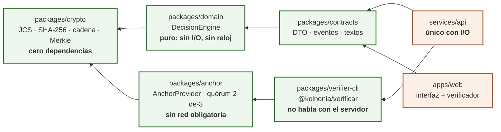
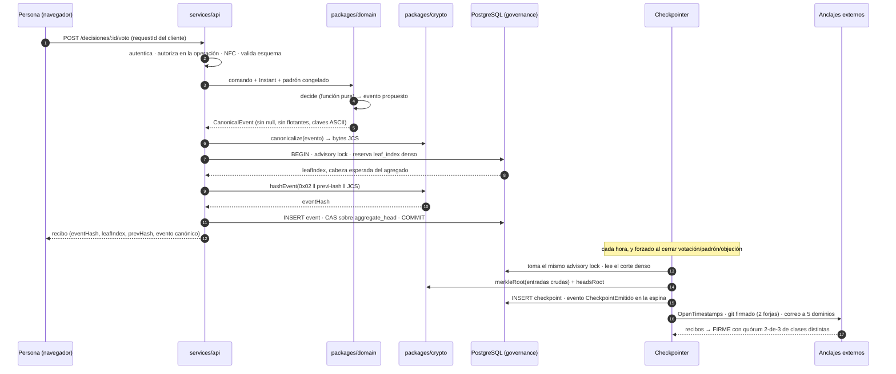
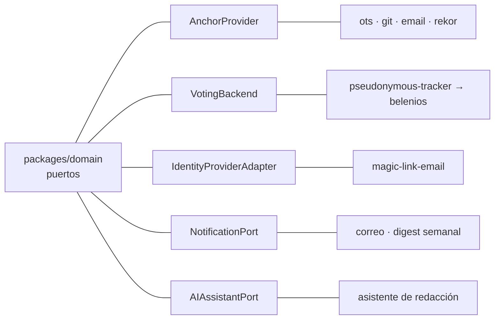

# Arquitectura de Koinonía

- **Estado:** vigente · **Fecha:** 2026-08-21
- **Precedencia:** este documento **describe**; no decide. Ante un conflicto mandan, por este orden,
  las resoluciones del arquitecto (`research/00-contradicciones-resueltas.md`), los ADR de `adr/`, y
  después las specs. Si algo de aquí contradice un ADR, lo que está mal es esto.
- **Para quién:** alguien que llega al repositorio y necesita saber dónde va cada cosa y qué está
  prohibido, antes de escribir la primera línea.

Koinonía es una plataforma de gobernanza para ~300 personas del Instituto de Filosofía de la
Universidad de Antioquia. Su promesa política es una sola frase: **nada de lo decidido puede alterarse
sin que se detecte**. Toda la arquitectura es consecuencia de sostener esa frase con un VPS que paga
un estudiante voluntario y un equipo que rota cada año.

---

## 1. Mapa del monorepo

Un solo repositorio, espacios de trabajo de pnpm, Node 22 ([ADR-0001](adr/0001-monorepo-typescript-con-dominio-puro.md)).

| Ruta | Qué es | Hace I/O | Depende de |
|---|---|---|---|
| `packages/crypto` | JCS (RFC 8785), SHA-256, cadena de eventos, árbol Merkle RFC 6962, pruebas de inclusión y consistencia | No | **Nadie** |
| `packages/domain` | Modelo de dominio y `DecisionEngine`: quórum, umbrales, métodos de decisión, delegación, sorteo, `Proof` | No | `@koinonia/crypto` |
| `packages/contracts` | Tipos y textos de frontera: DTO, formas de evento, cadenas de interfaz | No | `@koinonia/domain` |
| `packages/anchor` | **Anclaje externo**: `AnchorProvider` y tres implementaciones de clases de independencia distintas (OpenTimestamps sobre Bitcoin, commit firmado en dos forjas, testigos por correo), política de quórum 2-de-3 por clase y eventos del agregado `#anclaje` | No (los envíos son puertos) | `@koinonia/crypto` |
| `packages/verifier-cli` | **Verificador independiente** `@koinonia/verificar`. Ejecutable por npm que comprueba un export autocontenido **sin hablar con nuestro servidor**. Publica `README-VERIFICACION.txt`, que describe el algoritmo completo en prosa | Sólo lee el directorio del export | `@koinonia/crypto`, `@koinonia/anchor` |
| `services/api` | Adaptadores: PostgreSQL, HTTP, correo, KMS, anclaje. **Lo único que hace I/O**. Las migraciones del ledger viven en `services/api/migrations/` —SQL plano numerado— porque el DDL es parte del código que se revisa línea a línea, no del despliegue | Sí | `contracts` |
| `apps/web` | Interfaz. Incluye la pantalla «Verificar integridad», que corre en el navegador | Sí | `contracts` |
| `tests/` | Integración y extremo a extremo, fuera de los paquetes. Corren contra PostgreSQL real (Testcontainers): **cero mocks de la base**, que es justo lo que ocultaría los errores de tipos del §3 | Sí | todo |
| `infra/` | Despliegue y PostgreSQL de desarrollo (`infra/docker/`) | — | — |
| `docs/` | Investigación, ADR, producto, gobernanza, modelo de amenazas | — | — |

`packages/crypto` es la **hoja** del grafo y el artefacto más estable del repositorio: cambiarlo
invalida toda la historia anclada, así que su comportamiento queda congelado. Es la base de lo que se
publica en npm como verificador independiente (`@koinonia/verificar`, en `packages/verifier-cli`), y
por eso no puede arrastrar el motor de decisiones: quien compruebe hashes de 2026 en 2031 no debe
necesitar las reglas de gobernanza vigentes hoy.

La rama `crypto ← anchor ← verifier-cli` está **deliberadamente separada** de
`crypto ← domain ← contracts`. El verificador no conoce las reglas de decisión y no importa nada de
`services/api`: los algoritmos del §6.2 y del §6.4 del ledger están **reimplementados** en él, y que
las dos implementaciones coincidan es parte de la prueba. Si el verificador reutilizara el código del
servidor, sólo comprobaría que el servidor está de acuerdo consigo mismo.

## 2. Dependencias permitidas



El orden es **total y sin ciclos**: `crypto ← {domain ← contracts, anchor ← verifier-cli} ← services/api`.
`services/api` depende de `verifier-cli` **sólo para el formato del export**: el exportador y el
verificador tienen que hablar del mismo fichero, y el contrato lo define quien lo va a leer. La
lógica de verificación no viaja en esa dirección.

> ### Regla de pureza del dominio (obligatoria, verificada en CI)
>
> En `packages/domain` y `packages/crypto` está **prohibido**: acceso a red o disco, `Date.now()`,
> `new Date()`, `Math.random()`, `localeCompare`, variables de entorno, punto flotante en
> comparaciones de umbral, e importar cualquier cosa de `apps/`, `services/` o de un framework.
>
> **El tiempo y la aleatoriedad entran como datos**, nunca como efectos: el instante llega como
> parámetro `Instant` y la aleatoriedad como semilla verificable
> ([ADR-0024](adr/0024-semilla-commit-reveal-con-faro-externo.md)). La consecuencia es que el mismo
> escrutinio, ejecutado por cualquiera, en cualquier máquina, dentro de cinco años, produce el mismo
> hash. Sin eso, la auditoría ciudadana es un eslogan.
>
> Lo verifica `scripts/check-domain-purity.mjs` en cada CI, no una revisión de código. Una violación
> es un fallo de compilación, no una discusión.

## 3. Regla de tipos del ledger — norma de obligado cumplimiento

Esta regla es transversal a todos los esquemas del proyecto y **no admite excepción**. Se descubrió al
implementar `packages/crypto` contra la especificación del ledger, después de que el propio DDL de esa
especificación la violara en cinco columnas
(ver [E1](research/00-contradicciones-resueltas.md#parte-3--errores-detectados-por-la-implementación)).

> ### ⛔ Regla de tipos del ledger
>
> **Ningún valor que forme parte de la preimagen de un hash puede almacenarse en una columna cuyo tipo
> normalice su representación.** Esto proscribe `uuid` (reescribe la forma), `timestamptz` (normaliza
> la zona horaria), `numeric` (normaliza ceros a la derecha) y **muy especialmente `jsonb`, que
> reordena las claves del objeto y destruiría la canonicalización JCS**. El `payload` se almacena como
> `text` o `bytea` con la forma canónica exacta que se hasheó; si además se quiere consultar, se
> guarda una copia derivada en `jsonb` marcada explícitamente como **NO autoritativa**.

**Por qué es tan grave.** El fallo no es una excepción ni una pérdida de datos: es que al releer la
fila, la preimagen ya no es la que se hasheó, el `eventHash` no coincide, y el sistema declara
**«historia alterada» sin que nadie la haya alterado**. Un verificador que grita corrupción cuando no
la hay entrena a la asamblea a ignorarlo, y ahí muere la única garantía que el proyecto ofrece.

**Cómo se aplica en la práctica:**

| Concepto | Tipo obligatorio | Prohibido |
|---|---|---|
| `MemberId`, `aggregateId`, `decisionId` y todo identificador del ledger | `char(32)` + `CHECK (~ '^[0-9a-f]{32}$')` | `uuid`, ULID, UUIDv7 |
| `occurredAt`, `issuedAt` y toda marca temporal hasheada | `char(24)`, RFC 3339 `YYYY-MM-DDTHH:MM:SS.sssZ` | `timestamptz`, `timestamp` |
| `payload`, papeletas canonicalizadas, recibos de anclaje | `text` (bytes JCS exactos) | `jsonb` como columna autoritativa |
| Hashes | `bytea` + `CHECK (octet_length = 32)` | `text` hexadecimal como fuente |
| Cantidades del dominio | enteros o fracciones `{num, den}` como cadena | `numeric`, `float`, `double` |

**La regla es sobre participar del hash, no sobre el tipo.** `request_id` sigue siendo `uuid` y
`recorded_at` sigue siendo `timestamptz`: pertenecen al sobre del evento y no entran a ninguna
preimagen. No es una fobia a los tipos ricos de PostgreSQL.

**Corolarios:** (a) la prueba de admisibilidad es la ida y vuelta —`render(parse(t)) === t`—, no la
lectura; (b) toda copia derivada lleva sufijo `_idx` o vive en el esquema `projection`, y el
verificador nunca la lee; (c) se comprueba en CI contra una lista blanca de tipos por columna; (d) la
regla **sigue al hash, no al esquema**: alcanza también a `urn.ballots` y al `evidence_chain` del PII
Vault. Detalle en [`research/10-ledger-inmutable.md` §1.1-bis](research/10-ledger-inmutable.md).

## 4. El recorrido de un evento: de la petición HTTP al anclaje externo



Cuatro cosas que no son negociables en ese recorrido:

1. **La propiedad se comprueba en el dominio, en la misma operación que devuelve el dato**, nunca en
   un `guard` previo. El fallo de autorización dominante no es dar el permiso al rol equivocado: es
   darlo sobre el recurso de otro.
2. **El `leaf_index` es denso**, reservado con `UPDATE … RETURNING` dentro de la transacción, no con
   una secuencia. Una secuencia deja huecos al hacer `ROLLBACK`, y un hueco normal es una coartada
   perfecta para el borrado: «fue un rollback».
3. **Todo agregado nace colgado de la espina dorsal `#ledger`**
   (`00000000000000000000000000000001`), con doble vínculo. Sin eso, borrar un agregado completo no
   rompe ninguna cadena y es indetectable.
4. **La ventana de anclaje es la ventana de alterabilidad.** Lo ocurrido desde la última raíz anclada
   se puede reescribir sin contradecir nada externo. Por eso hay checkpoints forzados al cerrar una
   votación, al congelar un padrón y al cerrar una objeción: son los momentos que alguien querría
   reescribir.

Las proyecciones (`projection.*`) son **derivadas y desechables**: si hay que elegir entre el ledger y
una vista de lectura, gana el ledger siempre. Se borran y se reconstruyen desde `leaf_index = 0`.

## 5. Separación Governance Ledger / PII Vault

```mermaid
graph TB
  subgraph GOV["Governance Ledger — público, append-only, retención indefinida"]
    EV["governance.event<br/>eventos encadenados"]
    HD["governance.aggregate_head"]
    CP["governance.checkpoint"]
    RO["roll.voter_marks<br/><i>quién votó, sin fecha fina</i>"]
    UR["urn.ballots<br/><i>qué se votó, sin votante</i>"]
  end
  subgraph VAULT["PII Vault — privado, mutable, RLS, borrado físico"]
    PER["persona: nombre, correo,<br/>documento, programa"]
    MAP["mapeo MemberId ↔ persona"]
    CON["consent_logs"]
  end
  subgraph KS["Keystore — tercer almacén"]
    DSK["claves por sujeto (DSK envueltas)"]
  end

  EV -. "único puente:<br/>MemberId (aleatorio, no derivado)" .-> MAP
  RO -x UR
  MAP --> PER
  VAULT -. "destruir la clave<br/>es parte del borrado" .-> KS

  classDef pub fill:#eef7ee,stroke:#2d6a2d
  classDef priv fill:#fdeaea,stroke:#a02c2c
  class EV,HD,CP,RO,UR pub
  class PER,MAP,CON,DSK priv
```

Dos bases lógicas distintas, con roles de base de datos distintos y **sin ninguna clave foránea entre
ellas** ([ADR-0008](adr/0008-separacion-fisica-de-ledger-y-pii-vault.md)). La frontera es una regla
operativa, no una intuición:

> Un dato entra al Governance Ledger **si y sólo si su publicación íntegra a un desconocido no revela
> quién es una persona identificable**, asumiendo que ese desconocido tiene la lista pública de
> estudiantes del Instituto.

El único puente es el `MemberId`: 128 bits aleatorios de CSPRNG, **nunca derivados de ningún dato
personal** ([ADR-0006](adr/0006-memberid-aleatorio-de-128-bits.md)). Resolverlo a una persona exige un
*join* aplicativo contra la bóveda, y **ese join es el único punto donde se aplica RBAC y se registra
auditoría de acceso**. Como el identificador nunca fue función de nada, destruir la fila del vault lo
deja huérfano e irreversible: el borrado es real, no una promesa operativa
([ADR-0009](adr/0009-borrado-fisico-en-el-pii-vault.md)).

Dentro del ledger, la urna y el padrón están además separados entre sí: `roll` y `urn` no comparten
más que `decision_id`, no admiten FK ni índices compuestos, y un test de CI falla ante cualquier JOIN
entre ambos ([ADR-0013](adr/0013-prohibicion-estructural-de-vincular-padron-y-urna.md)). La urna **no
guarda hora**: con 300 votantes, el instante exacto es casi un identificador
([ADR-0014](adr/0014-sin-marcas-temporales-en-la-urna-y-sellado-por-lotes.md)).

**Lo que esto no garantiza** está sin adornos en
[`research/10-ledger-inmutable.md`](research/10-ledger-inmutable.md) y en
[`THREAT_MODEL.md`](THREAT_MODEL.md): la separación es una barrera de arquitectura y de control de
acceso, **no** una garantía criptográfica. Quien tenga acceso a las dos bases correlaciona en una
consulta.

## 6. Puertos y adaptadores

El dominio define **puertos** (interfaces); `services/api` provee **adaptadores**. Un puerto existe
cuando la decisión sobre el proveedor es reversible y queremos que siga siéndolo.



| Puerto | Qué abstrae | Implementaciones | Restricción propia | ADR |
|---|---|---|---|---|
| `AnchorProvider` | Publicar el checkpoint fuera del alcance del administrador | `ots` (Bitcoin), `git` (commit firmado en dos forjas), `correo` (testigos con acuse firmado). `rekor` queda como cuarta clase sin implementar | `verify(receipt, checkpointHash)` funciona **sin red** siempre que sea criptográficamente posible; lo que no se puede cerrar sin un dato externo se devuelve como `ResidualClaim` y **nunca** como `confirmado`. `independenceClass` obliga a quórum entre clases distintas, y `signingKeyOffHost = false` **descuenta** al proveedor | [0016](adr/0016-triple-anclaje-de-padron-marcas-y-escrutinio.md) |
| `VotingBackend` | Cómo se emite y escruta un voto | `pseudonymous-tracker` (MVP), `belenios` (etapa 2) | Al abrir cada elección se sella `guaranteesHash = hash(jcs(GuaranteeMatrix))` en el ledger: **la promesa hecha queda congelada** y no se puede reescribir después | [0011](adr/0011-votingbackend-como-puerto.md), [0018](adr/0018-belenios-como-destino-de-la-etapa-2.md) |
| `IdentityProviderAdapter` | Comprobar que alguien controla un correo `@udea.edu.co` | `magic-link-email` | No se asume ninguna API de la Universidad que no exista; un convenio futuro es un adaptador, no una reescritura | [0012](adr/0012-autenticacion-por-enlace-magico-al-correo-institucional.md) |
| `NotificationPort` | Avisar a una persona | correo, resumen periódico | Sujeto al **presupuesto de atención**: tope duro de notificaciones por persona y semana, y todo tipo de aviso con tasa de acción bajo 5 % se elimina, no se «mejora» | [0040](adr/0040-prohibicion-de-metricas-de-actividad-individual.md) |
| `AIAssistantPort` | Ayuda de redacción: teoría del cambio, resúmenes, detección de duplicados | proveedor externo, sustituible | **Nunca decide, nunca puntúa a personas, nunca escribe en el ledger.** Su salida es una sugerencia editable por quien redacta, y la persona sigue siendo la autora del evento | [0039](adr/0039-prohibicion-de-tokens-voto-ponderado-y-reputacion.md), [0040](adr/0040-prohibicion-de-metricas-de-actividad-individual.md) |

`AnchorProvider` y `VotingBackend` son los dos que llevan la garantía: si alguno se degrada, el
sistema lo **anuncia** en la portada en vez de callarlo. El estado público es `NO ANCLADO` **desde el
primer minuto sin quórum** —no a las 24 h—, porque durante esa ventana la historia reciente es
efectivamente alterable y llamarla «anclada» sería la confianza falsa que este diseño existe para
evitar; a las 24 h sube a alerta visible y a las 72 h las decisiones de ese lapso quedan marcadas como
*pendientes de confirmación de integridad*. Es una consecuencia de gobernanza, y es la única que hace
que alguien repare el problema.

### 6-bis. Anclaje externo y verificación independiente

Es la pieza que sostiene la promesa política del §0, y la única que un administrador con `root` no
puede falsificar. Todo lo demás —cadenas, espina, índice denso, raíces Merkle, pruebas de
consistencia— lo puede **recalcular** si reescribe la historia entera, y el resultado sería
internamente perfecto.

**Política de quórum (código, no documentación: `packages/anchor/src/quorum.ts`).** Un checkpoint es
`FIRME` sólo con **dos clases de independencia distintas** confirmadas. Dos recibos de la misma clase
no son dos testigos: comparten modo de falla. Un anclaje se descuenta con motivo explícito por cinco
razones: `no-confirmado`, `checkpoint-distinto`, `proveedor-repetido`, `clase-repetida` y
`clave-en-el-servidor-verificado`. La última es la que impide que el anclaje sea teatro: si la clave
privada vive en la máquina auditada, quien reescribe la historia firma la versión falsa, así que ese
proveedor **nunca** cuenta. Por eso `SignedGitProvider.submit()` no firma —produce la solicitud para
que la veeduría firme en su equipo— y `signingKeyOffHost` es un campo obligatorio sin valor por
defecto.

**Toda falla de anclaje se escribe en el agregado `#anclaje` del propio ledger.** Ocultarla exige
alterar el ledger, y alterar el ledger es lo que el anclaje detecta. Es circular a propósito: escala
el coste del encubrimiento.

**El export** (`services/api/src/ledger/export.ts`) es un directorio de texto autocontenido:
`manifest.json`, `events.ndjson`, `events.hashes.ndjson`, `heads.json`, `checkpoints.ndjson`,
`proofs/consistency/`, `anchors/`, `confianza.json` y `README-VERIFICACION.txt`. Publica el
`next_leaf_index` del cursor porque **sin él el truncamiento de la cola es indetectable**: al borrar
los últimos *k* eventos no queda ningún hueco y `count(*) = max(leaf_index) + 1` sigue dando verde.
Los `sha256` del manifiesto detectan una descarga corrupta y **nada más**; el informe lo dice con esas
palabras para que el verde del índice no parezca una garantía que no es.

**El verificador** (`npx @koinonia/verificar <ruta>`) comprueba las nueve capas, imprime en castellano
llano —qué se comprobó, qué significa y qué hacer— y devuelve un código de salida por tipo de fallo
(`0` correcto · `1` uso · `2` paquete ilegible · `3` sin anclaje firme · `4` anclaje inválido ·
`5` sellos incoherentes · `6` integridad interna rota). El modo `--explicar` describe en prosa qué
hace cada paso y por qué, para poder usarlo como herramienta pedagógica en una asamblea.

## 7. Stack elegido

| Pieza | Elección | Por qué, en una línea | ADR |
|---|---|---|---|
| Lenguaje y repositorio | TypeScript, monorepo pnpm, Node 22 | Un estudiante de filosofía debe poder leer el motor; si el dominio fuera Rust, el proyecto perdería a sus propios auditores | [0001](adr/0001-monorepo-typescript-con-dominio-puro.md) |
| Persistencia | PostgreSQL, event sourcing, **sin broker** | El estado es función del log; `LISTEN`/`NOTIFY` y una tabla `outbox` bastan a esta escala, y Kafka resuelve un problema que no tenemos a costa de un servicio más que operar a las 3 a.m. | [0002](adr/0002-event-sourcing-sobre-postgresql-sin-broker.md) |
| Función de hash | SHA-256, no BLAKE3 | Está en WebCrypto: el verificador independiente es una página estática sin WASM ni dependencias | [0003](adr/0003-sha-256-sobre-blake3.md) |
| Canonicalización | JCS (RFC 8785), vendorizada | Orden **por unidades de código UTF-16**; una actualización de dependencia que cambie el comportamiento invalidaría toda la historia | [0004](adr/0004-canonicalizacion-jcs-obligatoria.md) |
| Integridad | Cadena por agregado + checkpoint Merkle estilo Certificate Transparency | Verificación parcial barata en un móvil, más un compromiso global anclado fuera | [0005](adr/0005-cadena-de-hashes-por-agregado-y-checkpoint-merkle.md) |
| Aritmética | Enteros y fracciones exactas; sin punto flotante | El resultado es idéntico bit a bit en cualquier máquina; un épsilon de tolerancia es una decisión política disfrazada de constante | [0027](adr/0027-aritmetica-exacta-sin-punto-flotante.md) |
| Autenticación | Enlace mágico al correo institucional | Verificar un dominio de correo no requiere permiso de nadie ni crea corresponsabilidad con la Universidad | [0012](adr/0012-autenticacion-por-enlace-magico-al-correo-institucional.md) |
| Cifrado de PII | AES-256-GCM por sujeto, KEK fuera del servidor de aplicación | La destrucción de la clave es parte del borrado, así que no puede vivir junto a lo que protege | [0022](adr/0022-argon2id-y-pepper-solo-dentro-del-pii-vault.md) |
| Pruebas | Vitest + fast-check (`numRuns ≥ 1000` en el dominio) | Los invariantes se afirman con igualdad exacta, no aproximada; y los generadores incluyen caracteres fuera del BMP a propósito | [0001](adr/0001-monorepo-typescript-con-dominio-puro.md) |
| Licencia | AGPL-3.0-or-later | Si alguien la modifica y la despliega como servicio, las modificaciones vuelven a la comunidad que la usa | — |

---

## 8. Las tres cosas que hay que recordar

1. **La dirección de dependencia y la pureza del dominio no son estilo**: son la condición para que un
   tercero recompute un escrutinio de 2026 en 2031 y obtenga el mismo hash.
2. **La regla de tipos del ledger (§3) es de obligado cumplimiento en todo DDL del repositorio.** Se
   escribió porque la propia especificación del ledger la violaba en cinco columnas y nadie lo vio
   leyendo; lo vio quien la implementó.
3. **Ninguna garantía sobrevive al desinterés.** El anclaje protege la historia, no el servicio; las
   pruebas de consistencia protegen a quien guardó un checkpoint anterior. Si nadie ejecuta el
   verificador independiente, el sistema seguirá calculando hashes impecables mientras la propiedad
   central se degrada a *«no se puede alterar sin que se pueda detectar, si alguien mirara»*, que es
   una frase muy distinta.
