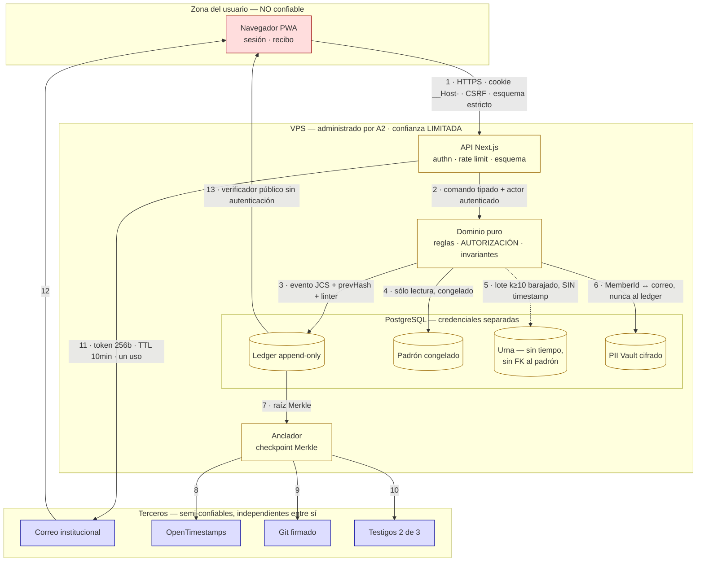

# THREAT_MODEL.md — Modelo de amenaza de Koinonía

> **Estado: NORMATIVO.** Cierra la contradicción **C18** del corpus («cuatro modelos de amenaza incompatibles, uno negando que hubiera adversario»). Desde su aprobación, **toda decisión de coste-beneficio en seguridad y privacidad se mide contra el modelo canónico de §0**. Cualquier afirmación de otro documento sobre quién es el adversario queda derogada.
>
> **Fecha:** 2026-08-21 · **Ámbito:** MVP self-hosted en un VPS del Instituto de Filosofía, ~300 estudiantes.

## Jerarquía documental

```
GOVERNANCE.md          → qué es legítimo decidir y con qué procedimiento
  THREAT_MODEL.md      → contra quién nos defendemos y qué aceptamos perder   ← ESTE
    docs/adr/          → decisiones técnicas concretas
      30-decision-engine-spec.md   → contrato de implementación del motor
        docs/research/ → insumo NO normativo
```

Regla operativa (C19): un documento inferior puede **señalar** una contradicción con uno superior, nunca resolverla. `20-normativa-datos-colombia.md` y `21-normativa-udea.md` son vinculantes en lo que afirmen **sobre la ley**, nunca sobre el diseño.

---

## 0. Modelo de amenaza canónico

Cuatro adversarios. El orden **no** es de severidad técnica: es de relevancia para lo que Koinonía existe para proteger.

**A1 · El grupo estudiantil organizado que quiere ganar una decisión. El más probable.** No rompe criptografía porque no le hace falta: coordina el momento de votar, copa una comisión, agota por cansancio a quien discrepa, encuentra la regla mal redactada y la usa. Su ataque es de **gobernanza**, no de software, y por eso las contramedidas son de **diseño institucional** tanto como técnicas. Un modelo que sólo mira el código no lo ve nunca.

**A2 · El administrador técnico con agenda política, o presionado. El más dañino.** Tiene root. Es un estudiante voluntario que rota cada año y no es profesional de seguridad; puede ser presionado por un docente o simplemente convencido de que su bando tiene razón. **Contra él la estrategia no es prevención sino DETECCIÓN.** No podemos impedir que actúe; podemos impedir que actúe **en silencio**: cada intervención suya debe producir una discrepancia observable por terceros que él no controla.

**A3 · El curioso interno que quiere saber cómo votó alguien para presionarlo. El más corrosivo.** Un compañero, un líder estudiantil, un docente con poder sobre notas o recomendaciones. No necesita privilegios: le basta un descuido de autorización horizontal, una URL enumerable, un panel que muestra de más, o pedirle a la víctima que le enseñe su recibo. Su daño no es técnico: destruye la disposición a discrepar, que es el insumo del que vive el sistema.

**A4 · El atacante externo oportunista. El menos relevante.** No hay dinero. Hay bots, escaneo de CVEs, credential stuffing y defacement. No lo ignoramos —una portada desfigurada el día de una votación es un incidente de legitimidad— pero no diseñamos contra un adversario con presupuesto.

**Corolario que rige todo el documento:** invertir contra A4 mientras A1 y A3 quedan desatendidos es el error clásico del software cívico. El presupuesto de ingeniería se asigna en el orden **A1 → A2 → A3 → A4**.

---

## 1. Activos y qué significa perderlos

No listamos activos técnicos: listamos lo que el Instituto pierde políticamente cuando cada uno cae.

**1.1 Integridad del registro de decisiones.** Event store append-only, cadena SHA-256 por agregado, espina dorsal global, checkpoints anclados. *Perderlo significa* que una decisión pueda ser negada después. El día en que alguien diga «esa propuesta nunca se aprobó así» y no haya cómo demostrar lo contrario, Koinonía deja de ser un registro y pasa a ser la opinión de quien administra el servidor: se vuelve a la asamblea con acta manuscrita, y el proyecto se recuerda como el intento fallido que además dio cobertura a una manipulación. *Propiedad exigida:* no *inmutabilidad* —imposible con root— sino **detectabilidad de la mutación por un tercero sin privilegios**.

**1.2 Secreto del voto.** *Perderlo* no produce vergüenza: produce **retaliación en un grupo de 300 personas que se vuelven a ver todos los días** durante cinco años, en pasillos, en comités de trabajo de grado y en cartas de recomendación. No genera escándalo, genera silencio: la gente deja de votar contra la corriente y el sistema empieza a devolver unanimidades falsas, que es como muere un sistema de gobernanza sin que nadie lo note.

> **CONTROL C6-GATE (normativo).** El MVP **no** garantiza secreto frente a A2 (ADR-0010). Un descargo en pantalla no es un control: es transferir el riesgo al usuario menos informado. Por eso la respuesta es estructural: el motor **rechaza abrir** todo proceso cuya clasificación exija secreto duro. `openDecision()` evalúa `requiresHardSecrecy(subject)` y falla con `HardSecrecyUnsupported`; el asunto va al **procedimiento en papel** de GOVERNANCE.md. **No hay bandera de configuración, permiso de administrador ni «modo avanzado» que lo desactive.** Se levanta sólo cuando exista un `VotingBackend` Belenios (ADR-0011, ADR-0018), mediante un ADR que derogue este bloque.
>
> Exigen secreto duro, como mínimo: sanciones o quejas sobre personas identificadas; evaluación de docentes o directivos; decisiones sobre la permanencia o la financiación de una persona concreta; y cualquier asunto que la asamblea clasifique así por consentimiento previo. Esto convierte una limitación en una **frontera de competencia de la plataforma**, que es lo que realmente es.

**1.3 Datos personales.** PII Vault cifrado: correo institucional, vínculo de matrícula, registros de consentimiento. *Perderlo* es publicar una lista de quiénes participan en política estudiantil, en un país donde eso ha tenido consecuencias. Jurídicamente, la sanción por tratamiento ilícito de sensibles es el **cierre inmediato y definitivo de la operación** (art. 23 lit. d, Ley 1581): el único activo cuya pérdida termina el proyecto por vía administrativa, sin que nadie discuta el diseño.

**1.4 Disponibilidad el día de una votación.** No es una molestia operativa, es un **vector de manipulación de resultado**: una caída de tres horas la tarde del cierre excluye selectivamente a quien vota tarde —en la jornada nocturna, un estrato entero—. Y aunque sea accidental, será leída como intencional. Un fallo de disponibilidad en ventana produce el mismo daño de legitimidad que un fraude, con menos esfuerzo del atacante.

**1.5 Legitimidad percibida.** El activo del que dependen todos los demás, y el único que puede perderse **sin que ocurra ningún incidente técnico**: basta con que A1 gane tres veces por procedimiento y media comunidad concluya que el juego está arreglado. Se defiende con verificabilidad pública y con reglas que no premien al mejor organizado, no con criptografía.

---

## 2. Actores de amenaza

| ID | Actor | Motivación | Capacidad | Acceso |
|---|---|---|---|---|
| **A1** | Grupo estudiantil organizado | Ganar una decisión concreta | Coordinar 15-40 personas; conocimiento fino del reglamento | Cuentas legítimas |
| **A2** | Administrador con agenda o presionado | Ideológica, presión de un tercero, favor personal | root, DB, backups, despliegue, logs | Total en el host |
| **A3** | Curioso interno (par, líder, docente) | Saber quién dijo qué, para presionar | Baja técnica, alta social | Cuenta legítima o ninguna |
| **A4** | Externo oportunista | Ruido, defacement | Escáneres, exploits públicos, botnets | Sólo red |
| **A5** | Ex-administrador | Resentimiento, continuidad de agenda | Igual que A2 mientras las credenciales vivan | Credenciales no revocadas |
| **A6** | Docente o directivo | Saber quién se opuso; disciplinar | Autoridad institucional, no técnica | Presión sobre A2 y sobre víctimas |
| **A7** | Equipo de desarrollo | Buena fe con efectos secundarios; o puerta trasera | Máxima: escribe el código que define las reglas | Repositorio, CI, dependencias |

**Lo peor que puede hacer cada uno.** **A1:** ganar limpiamente en lo formal y sucio en lo sustantivo —concentrar votos en la última hora, copar un sorteo postulándose en bloque, dilatar con objeciones (ADR-0032 es aquí una **superficie de abuso**, no sólo una garantía)— y sobre todo **agotar a la minoría hasta que deje de asistir**, para después ganar por unanimidad real. **A2:** insertar o suprimir eventos y reescribir la cadena; correlacionar padrón y urna y entregar la lista a A6; parar el servicio en la ventana crítica; y hacerlo **conservando la capacidad de negarlo** si el anclaje no funciona o nadie verifica. **A3:** obtener el recibo de un compañero pidiéndoselo «para verificar juntos» —transparencia convertida en coerción— o leer por IDOR el borrador de objeción de otro. **A4:** desfigurar la portada el día de la votación, agotar el envío de correo, o entrar por una dependencia con CVE y quedarse quieto. **A5:** el más subestimado —la rotación anual es una **transferencia de root sin ceremonia de revocación**: claves SSH que nadie quitó, un token en un `.env`, acceso al proveedor—; su ventaja sobre A2 es que **nadie lo está mirando**. **A6:** no ataca la plataforma, ataca a A2: una petición de un director a un estudiante voluntario no es una petición. Ninguna respuesta a A6 es técnica (§8). **A7:** el adversario que ningún control del propio sistema detecta, porque escribe los controles; una regla de quórum sutilmente mal implementada es indistinguible de un bug.

---

## 3. Catálogo de amenazas

STRIDE como andamio de cobertura, no como taxonomía a rellenar. **La prueba automatizada es obligatoria**: una amenaza sin prueba que la persiga es una intención, no un control. Rutas relativas a `tests/` y `packages/*/test/`.

Formato: `ataque → precondiciones → impacto → detectabilidad → mitigación MVP → mitigación posterior → prueba`.

> **Corregido el 2026-08-24 — auditoría completa de las citas de prueba de este catálogo.** Una
> verificación externa detectó que este documento «cita nombres de ficheros de prueba que no
> existen» y que en T-09 y T-18 eso ya se había corregido puntualmente. **Se generalizó el
> hallazgo**: se extrajeron mecánicamente los 28 nombres distintos de fichero `*.spec.ts` citados
> en todo §3 y se contrastaron, uno por uno, contra el listado completo y real de ficheros de prueba
> del repositorio (`find . -name "*.spec.ts" -o -name "*.test.ts"`, excluyendo `node_modules`: 145
> ficheros, más de 2 400 pruebas). **Resultado: los 28 nombres son ficticios. Ninguno existe, en
> ningún directorio, con ningún nombre parecido.** No es un error puntual de T-09 o T-18: es la
> convención de nombrado usada al escribir este catálogo entero (`tema.spec.ts::caso_en_snake_case`)
> y **nunca correspondió** a cómo se nombran realmente las pruebas de este repositorio, que usan
> `.test.ts` y viven junto al código que prueban (`packages/*/test/`, `services/api/test/`,
> `tests/integration/`), casi nunca con un nombre que coincida con el título de la fila.
>
> Los 28 nombres fantasma: `anchoring.spec.ts`, `assistant-prompt.spec.ts`, `assistant.spec.ts`,
> `authz-horizontal.spec.ts` (citado en §7), `availability.spec.ts`, `ballot-privacy.spec.ts`,
> `clock.spec.ts`, `commitment.spec.ts`, `concentration.spec.ts`, `concurrency.spec.ts`,
> `db-guardrails.spec.ts`, `decision-lifecycle.spec.ts`, `delegation.spec.ts`, `erasure.spec.ts`,
> `ledger-forbidden.spec.ts`, `ledger-tamper.spec.ts`, `magic-link.spec.ts`, `objections.spec.ts`,
> `pii.spec.ts`, `rate-limits.spec.ts`, `receipt.spec.ts`, `restore.spec.ts`, `roster.spec.ts`,
> `secrets.spec.ts`, `session.spec.ts`, `sortition.spec.ts`, `tally.spec.ts`, `voting.spec.ts`.
>
> **Esto no significa que las mitigaciones no existan** — en la mayoría de las filas sí hay código e
> incluso prueba real, sólo que bajo otro nombre y en otro fichero: se corrigió cada cita, fila por
> fila, señalando el fichero real cuando se encontró cobertura equivalente, o diciendo llanamente
> «no existe prueba con ese nombre» cuando no se encontró ninguna. **Por eso mismo hace falta leer
> cada fila corregida y no asumir que «tiene una cita real ahora» equivale a «se verificó todo lo que
> la fila afirma»**: la corrección de 2026-08-24 verificó la existencia del fichero y, cuando el
> tiempo alcanzó, una muestra de lo que prueba; no repitió la auditoría completa de cada control que
> ya hicieron las correcciones de T-09 (2026-08-22) y T-18 (2026-08-23) sobre sus propias filas. **Se
> encontraron además, y se marcan abajo, mitigaciones cuyo código no sólo tiene la cita de prueba mal
> puesta sino que directamente no existe** — T-17 (alarma automática a 26 h), T-23 (verificación de
> monotonicidad del reloj) y la arquitectura de urna separada de T-05/T-10/T-14/T-20 (ver el bloque
> nuevo antes de T-20). Esas son distintas de un simple nombre equivocado: son controles **sólo
> declarados**.
>
> **T-06, T-12, T-19 y T-25 no se tocan en esta corrección.** Tres agentes distintos están cerrando
> esas cuatro filas en este mismo momento (2026-08-24); quedan marcadas `EN CURSO 2026-08-24` más
> abajo para que no se lean como cerradas ni como abiertas hasta que esas sesiones terminen.

### 3.1 Integridad del registro (Tampering / Repudiation)

**T-01 · El administrador reescribe la historia** `A2` — **Estado: IMPLEMENTADA**
Modifica el payload de un evento pasado y recalcula la cadena del agregado hacia adelante → **Precond.** root; ningún checkpoint anclado posterior al evento → **Impacto** máximo: una decisión pasada cambia de contenido sin rastro local → **Detectab.** alta *sólo si el anclaje funciona* —la raíz recalculada no coincide con OTS, git ni testigos—; **nula sin anclaje operativo** → **MVP** checkpoint Merkle cada ≤24 h y al cerrar todo proceso; triple anclaje 2 de 3 (ADR-0016); verificador público de una sola orden → **Después** anclaje horario, testigos externos al Instituto, auditores automáticos → **Prueba** *(corregido 2026-08-24: `ledger-tamper.spec.ts` no existe)* `tests/integration/manipulacion.test.ts::«alterar UN byte del payload se detecta y se señala el evento EXACTO»`, `::«reordenar las claves del payload se detecta»`.

**T-02 · Modificación directa de la base de datos** `A2` — **Estado: IMPLEMENTADA**
`UPDATE`/`INSERT` con psql saltándose la aplicación → **Precond.** superusuario de PostgreSQL → **Impacto** alto: el resultado mostrado deja de derivar del ledger → **Detectab.** media-alta: el resultado es dato derivado (ADR-0026) y la reconstrucción debe reproducirlo bit a bit → **MVP** el rol de aplicación sólo tiene `INSERT`/`SELECT` sobre `events`; trigger `BEFORE UPDATE OR DELETE` que lanza excepción (`services/api/migrations/0002_append_only_guard.sql`); job que compara proyección viva contra reconstruida y alerta → **Después** réplica append-only fuera del control de A2 → **Prueba** *(corregido 2026-08-24: `db-guardrails.spec.ts` no existe)* `tests/integration/append-only.test.ts`. El propio comentario de la migración 0002 cita además un `borrado-de-agregado.test.ts` que **tampoco existe** como fichero separado — el mismo defecto, dentro de un fichero que no es propiedad de esta corrección; señalado, no corregido aquí.

**T-03 · Borrado de un agregado entero** `A2` — **Estado: IMPLEMENTADA**
`DELETE FROM events WHERE aggregate_id = X`: desaparece una propuesta incómoda completa → **Precond.** las de T-02 → **Impacto** alto y **silencioso**: una cadena por agregado no ve la ausencia del agregado entero, así que borrar todo es más limpio que modificar → **Detectab.** alta por la **espina dorsal global**, cuya secuencia densa queda con un hueco → **MVP** espina dorsal obligatoria verificada por el verificador público; el checkpoint incluye `count(events)` y `count(distinct aggregate_id)` → **Después** índice de agregados publicado a diario y firmado por los testigos → **Prueba** *(corregido 2026-08-24: `ledger-tamper.spec.ts` no existe)* `tests/integration/manipulacion.test.ts::«BORRAR UN AGREGADO ENTERO se detecta por el puntero colgante de la espina (§2.3)»`, `::«para tapar el borrado hay que romper también la espina, y eso se ve igual»`.

**T-17 · Manipulación por la vía del anclaje** `A2` — **Estado: PARCIAL**
No toca los datos sino al verificador: ancla sólo en el canal que controla, o deja de anclar confiando en que nadie lo note → **Precond.** apatía de los testigos; sin alarma por anclaje faltante → **Impacto** convierte todo el aparato de integridad en teatro → **Detectab.** trivial si se vigila, nula si no → **MVP** tres canales independientes con quórum 2 de 3; ~~alarma automática a las 26 h sin checkpoint, dirigida a los testigos y no al administrador~~; verificador documentado en el README → **Después** monitor externo al VPS que verifica cada hora → **Prueba** *(corregido 2026-08-24: `anchoring.spec.ts` no existe)* el quórum 2 de 3 sí está implementado y probado en `packages/anchor/src/quorum.ts` / `packages/anchor/test/quorum.test.ts`.
>
> **Corregido el 2026-08-24 — la alarma automática a 26 h no existe.** Se buscó en todo el
> repositorio cualquier tarea programada, `cron`, `setInterval` o mecanismo equivalente que
> comparara la edad del último checkpoint contra un umbral y notificara a los testigos: no hay
> ninguno. Lo que sí existe es el código `SIN_ANCLAJE` del verificador (`packages/verifier-cli/src/
> hallazgos.ts`), que **es pasivo**: sólo informa si alguien ejecuta el verificador a mano. Eso
> cubre la mitad «verificador documentado» de la fila, no la mitad «alarma automática dirigida a los
> testigos», que es justamente la que convierte la detección en algo que no depende de que alguien
> se acuerde de mirar. Se marca **PARCIAL** y no **sólo declarada** porque el quórum 2 de 3 —el
> control que de verdad impide que A2 controle el canal— sí está, probado y en producción.

**T-23 · Manipulación del reloj del servidor** `A2` — **Estado: SÓLO DECLARADA**
Atrasarlo para admitir votos tras el cierre, o adelantarlo para cerrar una votación que va perdiendo → **Precond.** root; el tiempo local como única autoridad de cierre → **Impacto** alto y **muy barato**: la mejor relación esfuerzo/resultado disponible para A2 → **Detectab.** media: el sello OTS da un límite superior verificable contra Bitcoin → **MVP** ~~el evento de cierre lleva el tiempo del servidor **y** el del último anclaje; el verificador señala monotonicidad rota y desvíos >5 min; **cerrar exige un checkpoint anclado previo**~~ → **Después** faro externo (drand/roughtime) en apertura y cierre → **Prueba** *(corregido 2026-08-24)* ninguna: `clock.spec.ts` no existe y no se encontró código equivalente.
>
> **Corregido el 2026-08-24 — toda la fila MVP era una descripción sin código detrás.** Se buscó en
> todo el repositorio (dominio y servidor) cualquier verificación de monotonicidad del reloj,
> cualquier comparación de desvío contra el anclaje con umbral de 5 minutos, y cualquier regla que
> impida cerrar una decisión sin un checkpoint anclado previo: **no existe ninguna**. La única
> coincidencia real con «monotonía» en el repositorio es sobre **monotonía de métodos de
> escrutinio** (IRV, INV-40/INV-42 en `packages/domain/test/props/tally-invariants.test.ts`), un
> concepto completamente distinto —matemática del recuento, no reloj del servidor— con el que esta
> fila no debe confundirse. El único control real contra este ataque hoy es indirecto: el sello
> OTS acota por arriba el instante de cierre contra Bitcoin, **si** el proceso ancla, lo cual coincide
> con lo que la fila ya declaraba como «Detectab. media». El resto de la mitigación MVP —el evento de
> cierre con doble tiempo, la verificación de desvío, el bloqueo de cierre sin ancla previa— **no
> existe y se retira del texto de mitigación**, dejando sólo lo que hay.

**T-24 · Eventos fuera de orden o duplicados** `A2` `A7` accidente — **Estado: IMPLEMENTADA**
Reenvío que produce dos `VoteCast`, o escritura concurrente que rompe la versión → **Precond.** sin concurrencia optimista ni idempotencia → **Impacto** medio-alto: corrompe el conteo sin intención maliciosa, que es como más probablemente ocurra → **Detectab.** alta con invariantes → **MVP** `UNIQUE(aggregate_id, seq)` (`event_agg_seq_uk`, `0001_governance_ledger.sql`); idempotencia por `request_id` con `UNIQUE (request_id)`; rechazo de todo evento cuyo `prevHash` no sea la cabeza actual; JCS previo al hash (ADR-0004) → **Después** verificación formal de invariantes → **Prueba** *(corregido 2026-08-24: `concurrency.spec.ts` no existe, y esta fila nombraba `command_id` cuando la columna real es `request_id`)* `tests/integration/append-concurrente.test.ts`.

### 3.2 Identidad y sesión (Spoofing / Elevation)

**T-04 · Sybil** `A1` — **Estado: IMPLEMENTADA**
Una persona controla varias identidades votantes → **Precond.** varios correos `@udea.edu.co`: segundo programa, cuenta de egresado viva, cuenta cedida → **Impacto** alto sobre el resultado, nulo sobre la integridad del registro → **Detectab.** baja técnicamente, media socialmente entre 300 personas que se conocen → **MVP** padrón cerrado y **congelado al abrir** (ADR-0025) con revisión humana; una cuenta = un `MemberId` = un correo; **hash del padrón sólo sobre los `MemberId` ordenados** (C10), para que cualquiera vea que el censo no creció; altas cerradas antes de abrir → **Después** contraste con el registro institucional si aparece SSO (C8 sigue abierta) → **Prueba** *(corregido 2026-08-24: `roster.spec.ts` no existe — señalado desde la corrección de T-18 del 2026-08-23, se cierra ahora)* `packages/domain/test/electorate.test.ts::«INV-03 — el padrón congelado ignora un alta posterior aunque la ventana siga abierta»` cubre el congelado; el correo único por `MemberId` no lo prueba el dominio puro sino el esquema: `email UNIQUE`, `email_hash UNIQUE` en `services/api/migrations/0005_identidad.sql:36-38`, sin prueba dedicada de integración que lo ejerza contra un intento de alta duplicada.

**T-05 · Doble voto y relleno de urna** `A1` `A2` — **Estado: PARCIAL, arquitectura distinta de la descrita — ver bloque antes de T-20**
Dos papeletas con la misma identidad, o papeletas sin identidad inyectadas desde el servidor → **Precond.** fallo de unicidad; para el relleno, root → **Impacto** máximo sobre el resultado → **Detectab.** total para el doble voto; para el relleno, **sólo por conteo agregado** → **MVP** ~~marca `UNIQUE(processId, MemberId)` en esquema separado y **sin clave foránea** hacia la urna (ADR-0013)~~; en su lugar, **idempotencia por última papeleta**: un `MemberId` puede emitir varias `BallotCast` mientras la decisión esté `Open` y sólo cuenta la de mayor `seq` (DECISIÓN A.5, `packages/domain/src/ballot.ts`), lo que también neutraliza el doble voto pero por un mecanismo distinto al que describe la fila; invariante pública `#papeletas ≤ #marcas ≤ |padrón|`; barajado verificable (ADR-0015) → **Después** Belenios: sin credencial ciega no hay papeleta y el relleno pasa de visible a imposible → **Prueba** *(corregido 2026-08-24: `voting.spec.ts` no existe)* la idempotencia por última papeleta (INV-07) está probada en `packages/domain/test/props/invariants.test.ts` y en `packages/domain/test/engine.test.ts`; **el esquema `urn` separado sin FK que ADR-0013 exige, y su verificación de CI, no existen** — ver el bloque de corrección antes de T-20, que cubre esta fila junto con T-10, T-14 y T-20.

**T-06 · Robo de sesión** `A3` `A4` — **EN CURSO 2026-08-24** (otra sesión está cerrando esta fila ahora mismo; no se toca aquí ni se afirma que siga abierta ni que ya esté cerrada)
Captura de cookie por XSS, equipo compartido de la sala de cómputo, o enlace reenviado → **Precond.** XSS, acceso físico o acceso al buzón → **Impacto** suplantación completa dentro del rol de la víctima → **Detectab.** baja, y **deliberadamente**: C17 prohíbe registrar IPs, que es la señal habitual. Preferimos no detectar el robo a construir un registro de ubicaciones de 300 activistas → **MVP** cookie `__Host-`, `HttpOnly`, `Secure`, `SameSite=Lax`; 8 h absolutas, 60 min de inactividad; **re-autenticación antes de votar si la sesión supera 30 min**; rotación del id en cada elevación; cierre global desde el perfil → **Después** WebAuthn para roles administrativos → **Prueba** `session.spec.ts::atributos_de_cookie`, `::voto_con_sesion_vieja_exige_reautenticacion`.

**T-21 · Enumeración de usuarios por el enlace mágico** `A3` `A4` — **Estado: IMPLEMENTADA**
Probar `nombre.apellido@udea.edu.co` y distinguir por texto, código o **tiempo** quién está inscrito; con correos predecibles esto reconstruye el padrón de participantes políticos → **Precond.** ninguna → **Impacto** alto para A3: la fuga más barata que existe → **Detectab.** media, por volumen → **MVP** respuesta **idéntica** siempre, mismo código y mismo cuerpo; tiempo nivelado; límite por sujeto con pimienta **rotada a diario** (no cada 24 h fijas: rota por día calendario) → **Después** prueba de trabajo del cliente ante ráfagas → **Prueba** *(corregido 2026-08-24: `magic-link.spec.ts` no existe)* `tests/integration/http-enlace-magico.test.ts::«un enlace inventado no dice si el correo existe: siempre el mismo rechazo»`, `::«NO se registra ninguna dirección IP»`, `::«la pimienta rota a diario»`.

**T-22 · Replay del enlace mágico** `A3` `A4` — **Estado: IMPLEMENTADA, con un número corregido**
Reutilizar un enlace usado, o uno interceptado en el buzón o en el historial de un equipo compartido → **Precond.** acceso al enlace → **Impacto** toma de cuenta → **Detectab.** alta si se registra el consumo → **MVP** token CSPRNG, **un solo uso** (el segundo canje se rechaza, comprobado incluso con dos canjes simultáneos), TTL ~~10 min~~ **15 min** (`services/api/src/http/identity.ts:14`, «Quince minutos» — se corrige el número: la fila decía 10) → **Después** confirmación con código de 6 dígitos en el navegador de origen → **Prueba** *(corregido 2026-08-24: `magic-link.spec.ts` no existe)* `tests/integration/http-enlace-magico.test.ts::«un enlace sirve UNA vez: el segundo canje se rechaza y lo dice con esas palabras»`, `::«REPRODUCCIÓN — dos canjes simultáneos del mismo enlace: exactamente una sesión»`, `::«el enlace vence a los 15 minutos, y el minuto 14 todavía sirve»`.

### 3.3 Gobernanza y proceso (Tampering sobre las reglas)

**T-19 · Captura del proceso por el grupo mejor organizado** `A1` — **la amenaza principal** — **EN CURSO 2026-08-24** (otra sesión está cerrando esta fila ahora mismo; no se toca aquí ni se afirma que siga abierta ni que ya esté cerrada)
Es la que va a ocurrir, es lo que Koinonía existe para contener, y su control es mayoritariamente **no técnico**.

**Ataque**, tres variantes reales: *(a) copar la ventana* — esperar a las últimas horas, cuando la posición contraria se relajó, y volcar 30 votos coordinados: legítimo en lo formal, decisivo en lo sustantivo; *(b) copar la comisión* — el sorteo estratificado (ADR-0031) sólo resiste si la postulación es amplia; si el grupo es el único que se postula en masa, el sorteo reparte entre sus miembros y produce un cuerpo «aleatorio» capturado; *(c) agotar a la minoría* — objeciones sucesivas y propuestas gemelas que obligan a la contraparte a defenderse cinco veces, usando ADR-0032 (presunción de validez de la objeción) como **arma** y no como garantía → **Precond.** asimetría de tiempo y coordinación: siempre presente → **Impacto** pérdida de legitimidad sin ningún incidente técnico; el peor resultado posible del proyecto → **Detectab.** **alta, y es nuestra mejor arma**: la coordinación deja huella estadística.

**MVP** — cinco controles, tres de ellos institucionales:
- **Métricas de concentración públicas y automáticas** al cerrar cada proceso: `HHI*` de voz con alarma desde **0,15** (ADR-0029, C20), reparto de autoría, y **alerta si >40 % de las emisiones cae en el último 10 % de la ventana**. Siempre agregadas, nunca por miembro (ADR-0040).
- **Ventana mínima de 72 h**, imposible de acortar una vez abierta (T-08): anula la ventaja de la coordinación instantánea.
- **`minDirectParticipation`** en reformas y elección de personas (spec 30 §D.1.b): sin piso de participación directa no hay decisión, sólo un grupo activo.
- **Umbral de postulación:** con menos de 3× postulantes que plazas el sorteo **no se ejecuta** y se reabre la convocatoria. El sorteo protege sólo si hay de dónde sortear.
- **Tope de 2 objeciones por actor y proceso**, la tercera con respaldo de otro miembro: preserva ADR-0032 y le quita el filo de arma de desgaste. Más **fecha de revisión obligatoria** en todo acuerdo (ADR-0033): ninguna captura es permanente si toda decisión caduca.

**Después** panel de salud deliberativa con series históricas; cuotas por estrato de **participación previa** —ejes: semestre, jornada, nivel y participación previa; **el género no es eje** (C11)—; rotación obligatoria de la facilitación → **Prueba** `concentration.spec.ts::hhi_supera_0_15_marca_proceso`, `::mas_del_40pct_en_ultimo_10pct_dispara_alerta`; `sortition.spec.ts::no_se_ejecuta_con_menos_de_3x_postulantes`, `::estratos_no_incluyen_genero`; `objections.spec.ts::tercera_objecion_exige_respaldo`.

**T-07 · Manipulación de una propuesta con la votación abierta** `A1` `A2` facilitación — **Estado: IMPLEMENTADA**
Editar el texto o añadir una opción después de que parte del censo ya votó, de modo que esos votos se apliquen a un texto que sus autores no leyeron → **Precond.** que el modelo permita mutar el agregado en `OPEN` → **Impacto** máximo, y la variante más difícil de discutir después porque el resultado es formalmente válido → **Detectab.** total si el texto se sella al abrir → **MVP** `DecisionOpened` incluye el **hash JCS del texto y del conjunto completo de opciones** (`proposalVersionHash`, `packages/domain/src/config.ts`); el dominio prohíbe toda edición en `OPEN`; cada papeleta referencia ese hash y la que no coincida se rechaza; corregir exige **cerrar por vicio y reabrir** con evento visible → **Después** papeleta firmada por el cliente con el hash del texto renderizado → **Prueba** *(corregido 2026-08-24: `decision-lifecycle.spec.ts` no existe)* `packages/domain/test/events.test.ts` y `packages/domain/test/state-machine.test.ts::«6. DecisionOpened dos veces es imposible: Open no lo admite»` cubren el sellado estructural; no se localizó, con el tiempo disponible, un caso que ejerza explícitamente «papeleta con hash distinto se rechaza» — verificar antes de la próxima revisión.

**T-08 · Cambio de quórum o umbral a mitad de camino** `A1` `A2` facilitación — **Estado: IMPLEMENTADA**
Ver el conteo parcial y ajustar la regla —bajar el quórum, cambiar la mayoría, mover la ventana— para que el resultado que ya se ve venir sea el deseado → **Precond.** parámetros en configuración mutable en vez de en el evento de apertura → **Impacto** máximo: el ataque de gobernanza más rentable y **el más fácil de justificar en público** («sólo corregíamos un error») → **Detectab.** total con parámetros sellados; nula con un archivo de configuración → **MVP** **todos** los parámetros —quórum, umbral, método, ventana, `minDirectParticipation`, desempate— se serializan **dentro** de `DecisionOpened` y son inmutables hasta el cierre; el resultado se computa sólo con ellos; **`ResultComputed` sólo es alcanzable desde `Closed`** en la máquina de estados (`packages/domain/src/state-machine.ts:144`) — no hay transición que lo genere en `Open`, así que «conteo parcial visible» no es sólo una política sino algo que el tipo no permite construir; toda reforma del reglamento **no aplica retroactivamente** a decisiones abiertas → **Después** firma de los parámetros por dos roles distintos al abrir → **Prueba** *(corregido 2026-08-24: `decision-lifecycle.spec.ts` y `tally.spec.ts` no existen)* `packages/domain/test/state-machine.test.ts` prueba la máquina de estados citada arriba; la inmutabilidad de parámetros la ejerce `packages/domain/test/decision-opening-invariants.test.ts`.

**T-09 · Colusión entre delegados** `A1` — **Estado: IMPLEMENTADA (corregida el 2026-08-22, ver abajo; cita de prueba corregida el 2026-08-24)**
Concentrar delegaciones en dos o tres personas que votan en bloque: peso desproporcionado con apariencia de participación amplia; variante en cadena o circular que amplifica sin que nadie lo vea → **Precond.** delegación sin tope ni caducidad → **Impacto** alto; es la tensión C20 en forma aguda → **Detectab.** alta: la concentración es medible → **MVP** delegación con caducidad y **tope sobre el censo** (ADR-0029); rechazo de ciclos; **profundidad máxima 4**; `HHI*` publicado por proceso; **delegación prohibida en voto secreto** (ADR-0030); revocación efectiva hasta el cierre → **Después** tope dinámico según participación directa observada → **Prueba** *(corregido 2026-08-24: `delegation.spec.ts` no existe)* `packages/domain/test/delegation.test.ts::«C.4 / INV-25 — ciclos»`, `::«C.4.2 / INV-26 — profundidad»`, `::«INV-29 — una delegación caducada no aplica»`; `packages/domain/test/delegation-engine.test.ts::«C.4.a — los ciclos se previenen al conceder»`.

> **Corregido el 2026-08-22 — T-09 decía «profundidad máxima 1» y nombraba la prueba
> `::cadena_de_profundidad_2_es_rechazada`. Las dos cosas eran falsas.** El límite es **4 aristas**:
> lo fija `GOVERNANCE.md` §5 («cadenas de máximo cuatro pasos») y lo recoge ADR-0029 con
> `maxDepth = 4`, que es también el valor por defecto de `DelegationConfig` en
> `30-decision-engine-spec.md` §C.1 y lo que implementa `packages/domain`. Por la jerarquía de arriba
> **`GOVERNANCE.md` manda sobre este documento**, así que la corrección va aquí y no allá.
>
> **Se corrigen las dos, y el nombre de la prueba es el que más importa.** Un umbral equivocado en
> prosa lo desmiente cualquier lector que abra el ADR; **un nombre de prueba equivocado es una
> instrucción**. `::cadena_de_profundidad_2_es_rechazada` le dice a quien lo lea que una cadena de dos
> pasos debe fallar, y la forma más natural de «arreglar» esa prueba en rojo es bajar `maxDepth` a 1
> para que cuadre con el documento. Sería el modo de fallo de **C4** y de **E24** por tercera vez: una
> corrección con forma de corrección, anclada en un test, contra el documento normativo que tenía
> razón. Con `maxDepth = 4`, la primera cadena que debe rechazarse es la de **cinco** aristas.
>
> El resto de la fila no se toca: el rechazo de ciclos, el tope sobre el censo, el `HHI*` publicado y
> la prohibición en voto secreto son correctos y están implementados.

**T-18 · Manipulación del padrón** `A2` facilitación
Añadir votantes afines o excluir disidentes antes de abrir, o alterar estratos para sesgar un sorteo. **Quién está en el padrón decide el resultado más a menudo que cómo se cuenta** → **Precond.** control del alta o de la base → **Impacto** máximo → **Detectab. partida en dos, y hay que leerla así:** **alta** para toda alteración **posterior** al congelado, porque el padrón queda sellado en `DecisionOpened` y anclado; **nula** para toda alteración **anterior** al congelado, porque el padrón vive en `identity.member`, una tabla mutable sin cadena de huellas, y la apertura fotografía sin más lo que encuentre. **Congelar no cierra el ataque: le pone fecha límite, y conserva para siempre lo que se haya congelado mal** → **MVP** padrón congelado al abrir e inmutable (ADR-0025); **hash publicado sólo sobre los `MemberId` ordenados** (C10) y anclado con el checkpoint; **estratos publicados agregados, nunca por miembro** (C10, C11); pertenencia verificable por prueba de inclusión Merkle; toda alta o baja posterior a la apertura queda fuera del proceso, sin excepción. **Lo que ninguno de estos controles hace es acreditar la procedencia del censo**: ver ADR-0054 → **Después** **agregado de padrón event-sourced con cofirma externa por transición (ADR-0054, Propuesto — es lo único de esta fila que ataca la mitad no cubierta)**; doble firma del padrón por secretaría y un testigo antes de abrir → **Prueba** `packages/domain/test/electorate.test.ts:68` (el `rollHash` ignora estratos y atributos), `:148` e `:155` (INV-03, el alta posterior no entra), `:166` (A.3, la baja posterior permanece en `N`), `:186` (INV-02, la elegibilidad se decide contra el snapshot y no contra el registro vivo). **Sin prueba: que un padrón modificado invalide el hash anclado** —`verifyRollHash` sólo se afirma en positivo (`:91`) y el caso negativo no existe— **y la procedencia del registro, que no tiene contra qué probarse hasta que se decida ADR-0054.**

> **Corregido el 2026-08-23 — T-18 confundía la integridad del retrato con la autenticidad de su
> fuente, y de ahí sacaba una «detectabilidad alta» que es falsa.** Lo que decía, literalmente:
> «**Detectab.** alta si el padrón se congela y su hash se publica», y como prueba
> `roster.spec.ts::hash_ignora_estratos_y_atributos`, `::estratos_solo_agregados`,
> `::padron_modificado_invalida_el_hash_anclado`. Se corrige la fila y **no se borra lo que decía**,
> porque la fila estuvo vigente y decisiones se tomaron leyéndola.
>
> **Por qué era falsa.** Congelar y publicar el hash demuestra que **el padrón no cambió después de
> abrir**. No demuestra —no puede— que la lista congelada correspondiera a matrículas legítimas. El
> padrón es el **denominador de todas las reglas** de `GOVERNANCE.md` §4 y es el **único estado de
> gobierno que no está en el historial encadenado**: vive en `identity.member`, tabla mutable
> (`services/api/migrations/0005_identidad.sql:31`) sobre la que la aplicación tiene `UPDATE` y
> `DELETE` (`:145`); el alta no emite ningún evento (`services/api/src/http/identity.ts:132`,
> invocada desde `services/api/src/http/app.ts:512`); y `registryVersion` es la constante `1`
> (`services/api/src/http/service.ts:580`), así que ni siquiera hay continuidad versionada que
> delate un salto. Quien administra altera la tabla, abre, deja que el congelado selle esa lectura y
> restaura. **Contra ese ataque la detectabilidad no es alta: es cero**, y el `rollHash` anclado
> pasa de ser un control a ser el sello que protege el fraude.
>
> **Y el verificador independiente lo daría por bueno.** Sus 25 códigos de hallazgo
> (`packages/verifier-cli/src/hallazgos.ts:19-48`) cubren el export, la cadena, los checkpoints y el
> anclaje. **Ninguno cubre la procedencia.** Ante un padrón fraudulento congelado limpiamente saldría
> verde: certificaría una mentira coherente. Decir «detectabilidad alta» en la fila que gobierna el
> denominador de todo el sistema es el peor sitio del documento para una afirmación de más.
>
> **La corrección del nombre de las pruebas importa tanto como la de la prosa, por lo mismo que se
> dijo en T-09 el 2026-08-22: un nombre de prueba equivocado es una instrucción.** `roster.spec.ts`
> **no existe en el repositorio** —ni con ese nombre ni con otro—; lo que cubre parte de la fila es
> `packages/domain/test/electorate.test.ts`, con 14 casos. De las tres pruebas que se nombraban, una
> sí existe con otro nombre y en otro fichero (`:68`), y **dos no existen**:
> `::estratos_solo_agregados` no tiene equivalente, y `::padron_modificado_invalida_el_hash_anclado`
> **tampoco**: `verifyRollHash` sólo aparece afirmado en positivo (`:91`) y **el caso negativo —el
> que sostiene toda la mitigación— no se prueba en ninguna parte**. Por §3 («una amenaza sin prueba
> que la persigue es una intención, no un control») y por §9 (cobertura amenaza → prueba del 100 %),
> esta fila **no cumplía** y ahora lo dice.
>
> ⚠ **`roster.spec.ts` se nombra también en T-04**, con dos pruebas más que tampoco existen. **No se
> corrige aquí**: se señala, para que quien revise T-04 sepa que arrastra el mismo fichero fantasma.
>
> **El hueco no es nuevo y esta es la tercera vez que se escribe.** Está registrado como **E93** en
> `docs/research/00-contradicciones-resueltas.md:2084` y en el comentario de cabecera de
> `services/api/src/constitution/index.ts:95-104`, que además señala que `GOVERNANCE.md` §7 promete
> lo contrario de lo que ocurre: «todo acto administrativo es un evento público en el mismo
> historial» (`docs/GOVERNANCE.md:236`) y quien administra «no puede crear, eliminar o modificar
> miembros del padrón» (`:230`). **Por la jerarquía de arriba, `GOVERNANCE.md` manda sobre este
> documento**, así que aquí sólo se **señala** la contradicción (regla C19) y se deja la resolución a
> **ADR-0054**, que está en **Propuesto** porque la elección de fondo —qué promete la plataforma
> cuando alguien pide que lo borren— es jurídica y política, no técnica.
>
> **Lo que no se toca de la fila, porque es correcto:** el impacto máximo, la frase de que quién está
> en el padrón decide más resultados que cómo se cuenta, el hash sólo sobre `MemberId` ordenados, los
> estratos agregados y la exclusión de toda alta o baja posterior a la apertura.

**T-27 · Aprobación huérfana o ejecución sustituida** `A2` `A4` — **Estado: IMPLEMENTADA (citas de prueba ya eran reales, sin corrección necesaria)**
Persistir el resultado y crear después la iniciativa permite que una caída deje un acuerdo aprobado sin
ejecución; reutilizar una reserva ya ocupada puede enlazar el trabajo de otra decisión; mezclar el
borrador de una propuesta con la configuración de otra cambia qué se ejecuta después del voto; tratar
como replay cualquier clave ya usada sobre el mismo agregado puede saltarse silenciosamente uno de los
append del commit compuesto →
**Precond.** escrituras separadas, replay sin vínculo semántico o manipulación directa → **Impacto**
máximo sobre la mitad ejecutiva: el resultado formal existe pero la obligación acordada no →
**Detectab.** alta sólo si se verifica cardinalidad y contenido, no sólo cadenas → **MVP** plan dentro
de `proposalVersionHash`; coincidencia borrador/configuración durante replay; apertura atómica
semilla+decisión+enlace; reserva aleatoria de iniciativa; cierre `DecisionClosed + ResultComputed +
InitiativeCreated` en una transacción; replay idempotente sólo ante igualdad del lote canónico;
reutilización divergente como 409 con rollback; verificación bidireccional de iniciativa y de
`DecisionLinked` sobre snapshot consistente
(ADR-0043) → **Después** restricción materializada única por `decisionId` en una proyección reconstruible
y checkpoint forzado al ratificar → **Prueba**
`http-iniciativa-atomica.test.ts::{apertura_idempotente,clave_de_enlace_ocupada_revierte,clave_de_cierre_ocupada_revierte,cierre_concurrente,colision_revierte_cierre,iniciativa_historica_es_rechazada,enlace_bidireccional}`,
`append-concurrente.test.ts::la_misma_clave_con_payload_distinto_se_denuncia` y
`decision-opening-invariants.test.ts`.

**T-28 · Activación prematura, asignación fantasma, fuga o respuesta obsoleta** `A2` `A4` `A7` — **Estado: no verificado en profundidad en esta corrección (no cita ficheros de prueba con nombre — describe tipos de prueba, no ficheros — así que no aplica el hallazgo de citas ficticias de este catálogo; queda pendiente una verificación de implementación dedicada)**
Contar la ventana de impugnación desde el cierre nominal aunque el resultado se publique tarde puede
activar trabajo antes de que la comunidad haya tenido tiempo real de objetar; una tarea marcada como
asignada sin aceptación atribuye una obligación inexistente; una aceptación o reoferta retardada
puede aplicarse después de que la tarea ya recorrió otro ciclo; y una justificación libre puede
publicar salud, empleo u otra PII en un ledger indeleble → **Precond.** publicación repetible o sin
instante, confianza en sesión/membresía obsoleta, estado mutable sin identidad/revisión de oferta,
mutaciones concurrentes o texto personal en eventos públicos → **Impacto** alto: ejecución de una
decisión todavía impugnable, responsabilidad falsa, reasignaciones erróneas y exposición irreversible
de datos personales → **Detectab.** alta sólo si cada paso
es un evento enlazado y el verificador cruza decisión e iniciativa → **MVP** `ResultComputed` único y
`resultComputedAt`; ventana desde `max(closedAt,resultComputedAt)`; ratificación+activación atómicas;
un solo instante para comprobar matrícula y fechar ambas mitades;
`TaskOffered` no crea `assigneeId`; `offerId=eventId`; aceptación, rechazo, solicitud y reoferta
exigen oferta y revisión vigentes; CAS por revisión de tarea además de transacción serializada; actor y
destinatario se revalidan contra una fila de membresía bloqueada, no sólo contra la sesión; motivos
cerrados sin texto libre en el ledger; clave de idempotencia estable tras perder la respuesta;
reautorización viva incluso en replay; administrador técnico sin permisos (ADR-0044); capacidad
privada y seguimiento con revisión CAS (ADR-0045) → **Después** reasignación por revisión colectiva
del círculo → **Prueba** tests de dominio de oferta obsoleta/ABA, integración de
aceptar-vs-rechazar-vs-reasignar concurrentes, retiro concurrente, ausencia de texto personal,
rollback del commit compuesto y E2E de aceptación explícita con reintento tras respuesta perdida.

**T-29 · Sustitución de evidencia, fuga de capacidad o seguimiento punitivo** `A2` `A3` `A4` `A7` — **Estado: no verificado en profundidad en esta corrección (misma nota que T-28: no cita ficheros de prueba por nombre)**
Un administrador reemplaza una evidencia restringida conservando su referencia; otra persona usa un
ID manipulable para leerla; el responsable infiere salud o empleo a partir de la capacidad o del
tamaño/nombre del archivo; dos aceptaciones concurrentes exceden el límite; o un bloqueo temprano se
convierte en una métrica individual de incumplimiento → **Precond.** material sin compromiso
vinculante, endpoint por `memberId`, capacidad o metadata en respuestas compartidas, doble escritura
sin cerrojo, o proyección individual pública → **Impacto** alto: memoria de ejecución falsa, fuga de
datos sensibles y diseño que castiga pedir ayuda → **Detectab.** alta para sustitución si conserva la
apertura, baja para lectura/uso punitivo → **MVP** máquina append-only con CAS de oferta, tarea, pausa y
entrega; categorías cerradas; commitment con nonce y contexto; evidencia restringida sin texto, URL,
MIME ni tamaño exacto; capacidad AES-256-GCM self-only y sin evento; aceptación atómica con orden
`ledger → miembro`; ninguna métrica individual ni permiso de aplicación para `ADMIN` (ADR-0045) →
**Después** S3 con objeto cifrado, URLs cortas, publicación por copia saneada, journal de supresión y
réplica/custodio fuera de A2 → **Prueba** invariantes de transición, IDOR indistinguible, tamper de
ciphertext/objeto, doble aceptación sobre el último cupo, aceptar-vs-bajar capacidad y linter de
payloads privados. El texto cifrado ocupa siempre 131 088 bytes y `/integridad` autentica todas las
aperturas esperadas y denuncia faltantes/huérfanas con una salida sanitizada; quitar el índice de
`eventId` tampoco oculta duplicados al verificador semántico del servidor ni al CLI independiente.
Una supresión normal exige primero `PIIErasureRequested` desde una sesión propia fresca; el ejecutor
recibe sólo ese agregado, deriva al sujeto, autentica el conjunto, borra por cascada y registra
`PIIErased` enlazando ID y hash de la autorización. La auditoría sigue roja ante `DELETE` directo,
ante solicitud pendiente borrada y ante `DELETE` más tombstone exacto sin solicitud propia. Esto
evita soberanía política del técnico dentro del modelo de sesión; una app/root totalmente
comprometida aún puede fabricar ambos appends y requiere firma cliente o custodio externo posterior.

### 3.4 Privacidad (Information Disclosure)

> **Corregido el 2026-08-24 — la separación estructural `roll`/`urn` que sostiene T-05, T-10, T-14 y
> T-20 no existe en el esquema real.** ADR-0013 («Prohibición estructural de vincular padrón y
> urna», **Aceptado**) describe dos esquemas de PostgreSQL, `roll` y `urn`, sin clave foránea entre
> ellos, con roles de base distintos y un test de CI que analiza el SQL emitido y falla ante
> cualquier `JOIN` entre ambos. ADR-0014 («Sin marcas temporales; lotes k=15/60 min», Aceptado)
> describe una `urn.ballots` sin columna de tiempo y con sellado por lotes barajados.
>
> **Se verificaron directamente las migraciones reales** (`services/api/migrations/*.sql`): los
> únicos esquemas que existen son `governance`, `identity` y `projection`. **No hay esquema `roll` ni
> `urn`.** Las papeletas se guardan como eventos `BallotCast` dentro de la misma tabla única
> `governance.event` que todo lo demás, y el tipo `Ballot` del dominio (`packages/domain/src/
> ballot.ts:96`) tiene un campo `voter: MemberId` **obligatorio** — la papeleta lleva quién votó,
> dentro del mismo registro que se ancla y se publica. Además, **cada fila de `governance.event`
> lleva `recorded_at timestamptz NOT NULL DEFAULT clock_timestamp()`** (`0001_governance_ledger.sql:
> 99-101`) — una marca de tiempo real de inserción, en la misma tabla que las papeletas — y el orden
> de inserción es el `leaf_index` secuencial de un único log, exactamente el canal de correlación que
> T-20 describe como el ataque a impedir. No se encontró, en ninguna parte del código, sellado por
> lotes, barajado con CSPRNG, tamaño mínimo `k`, ni un concepto de «recibo de papeleta sin la opción
> elegida» (T-10) o de commitment de comentarios (T-14, ver su fila).
>
> **Qué explica esto y qué no.** ADR-0010 («El MVP no implementa criptografía de urna», Aceptado) ya
> declaraba que el secreto duro no está garantizado, y el **CONTROL C6-GATE de §1.2 sí existe y sí
> está probado** (`packages/domain/src/config.ts:599`, `HardSecrecyUnsupported`,
> `packages/domain/test/config.test.ts`): todo proceso que exija secreto duro se **rechaza al abrir**,
> no llega nunca a tener papeletas que proteger. Eso es real y no se toca. **Lo que no es real es que
> los procesos que sí se abren tengan la protección intermedia que T-05, T-10, T-14 y T-20 describen**
> —ni urna separada, ni sellado por lotes, ni recibo sin contenido, ni comentario con commitment—: hoy
> esos procesos guardan la papeleta con el votante y con hora de inserción, en el mismo log público
> que todo lo demás. Contra A2 esto no cambia nada (F-1 ya asume acceso total). **Contra A3 —el
> adversario que motiva T-10 y T-20, el que no necesita privilegios— sí cambia**: si el ledger es
> públicamente verificable sin autenticación (§5, cruce 13, «por diseño») y cada `BallotCast` lleva
> `voter` y `recorded_at`, entonces cualquiera que sepa el `MemberId` de una persona —el propio
> interesado, o alguien a quien se lo mostró— puede leer exactamente qué votó, sin necesitar acceso
> a root ni al vault.
>
> **Esto no se resuelve en esta corrección.** Es un hallazgo de arquitectura, no una errata de prosa,
> y decidir la respuesta —implementar de verdad la separación de ADR-0013/0014, degradar esos ADR a
> «Propuesto» y admitir la brecha, o acotar el alcance real del secreto declarado en pantalla— es
> exactamente el tipo de decisión que este documento no puede tomar por su cuenta (regla operativa
> C19: un documento inferior señala, no resuelve). **Queda señalado aquí, en el lugar donde afecta a
> cuatro filas a la vez, para que se decida con la misma seriedad con la que se decidió ADR-0054 para
> el padrón** —de hecho es el mismo patrón: una separación estructural prometida en un ADR Aceptado,
> que resultó no estar en el esquema real, encontrada por auditoría y no por lectura del código.

**T-20 · Correlación votante↔voto por temporización** `A2` `A3` — **Estado: SÓLO DECLARADA — ver el bloque de corrección arriba**
Cruzar la marca de participación («Ana participó a las 14:32») con la papeleta («insertada a las 14:32»); con 300 personas y participación dispersa, la mayoría de papeletas quedan solas en su minuto. Es lo que hace **irrelevante** la separación de esquemas si el tiempo sobrevive → **Precond.** marcas temporales en la urna, orden de inserción correlacionable, o logs del proxy → **Impacto** pérdida total del secreto sin dejar rastro → **Detectab.** **nula: es lectura, no escritura** → **MVP** ~~sin marcas temporales y sellado por lotes (ADR-0014): lotes de **k ≥ 10** o cada 30 min —lo que ocurra después— en **orden barajado con CSPRNG**; identificadores de papeleta aleatorios, nunca secuenciales~~; **ninguna IP en la aplicación** (C17, esto sí se verificó independientemente y es real: ver T-11) → **Después** Belenios; mixnet; envío de papeleta por un servicio distinto del que atiende el padrón → **Prueba** *(corregido 2026-08-24: `ballot-privacy.spec.ts` no existe, y ninguna de las cuatro pruebas que nombraba tiene equivalente)* ninguna — no hay sellado por lotes que probar. **La papeleta real SÍ tiene marca temporal** (`recorded_at`) y **SÍ es secuencial** (`leaf_index`), lo contrario de lo que esta fila afirmaba. Detalle completo en el bloque de corrección justo antes de esta fila.

**T-10 · Coerción del votante** `A1` `A3` `A6` — **Estado: SÓLO DECLARADA para el recibo — ver bloque antes de T-20**
«Enséñame tu recibo». El recibo es garantía de verificabilidad individual y, por lo mismo, **prueba de contenido exportable** que un líder o un docente puede exigir; entre 300 personas que se conocen, la petición no necesita ser una amenaza para funcionar → **Precond.** que el recibo revele la opción y sea presentable fuera de la sesión → **Impacto** el más corrosivo: no produce un incidente, produce conformidad → **Detectab.** **nula, ocurre fuera del sistema** → **MVP** ~~el recibo es un **identificador de papeleta con su prueba de inclusión, sin la opción elegida**: demuestra «mi voto está contado», no «voté X»; la interfaz no ofrece exportar ni compartir el contenido y no lo vuelve a mostrar tras confirmar~~; **C6-GATE** deriva a papel los asuntos de alta coerción (esto sí es real, ver §1.2) → **Después** papeletas falsas verificables (*fake credentials*, JCJ/Belenios), única defensa real → **Prueba** *(corregido 2026-08-24: `receipt.spec.ts` no existe, ni ningún fichero equivalente)* ninguna: no se encontró ningún concepto de «recibo de votante» en el código — `packages/anchor/src/receipt.ts` existe pero es el recibo del **anclaje del checkpoint**, no un recibo por papeleta, y no tiene relación con esta fila. Ver el bloque de corrección antes de T-20.
>
> **Precisión del 2026-08-25 (ADR-0056), sobre la propia cita a §1.2 de esta fila.** «C6-GATE deriva a
> papel los asuntos de alta coerción» describe bien el **efecto**, pero no el **mecanismo**: se
> verificó `assertHardSecrecySupported` (`packages/domain/src/config.ts:598-600`) y no existe, en todo
> el repositorio, ninguna función `requiresHardSecrecy(subject)` ni clasificador de asunto. La
> compuerta no distingue «asuntos de alta coerción» de otros: bloquea, sin condición, **todo** intento
> de abrir con `privacy: 'secret-ballot'`, sea cual sea el tema. Quien decide si un asunto es delicado
> es quien abre la decisión, eligiendo el modo — no un clasificador automático. El efecto práctico que
> cita esta fila sigue siendo cierto (los asuntos que se abren con `secret-ballot` sí van a papel), pero
> conviene no leerlo como si el sistema supiera reconocer coerción por sí mismo. ADR-0056 evalúa,
> además, qué ofrecen Helios y Belenios contra esta amenaza (R7 en su tabla): ninguno de los dos, en su
> variante base, la resuelve; sólo BeleniosRF lo intenta, y no está disponible en producción.

**T-11 · Fuga de datos personales** `A2` `A4` `A7` — **Estado: PARCIAL**
Volcado del vault o de un backup; respuesta de API que devuelve de más; traza de error con el correo dentro → **Precond.** acceso al host o a un backup, o fallo de autorización horizontal (§7) → **Impacto** el único riesgo que cierra el proyecto por vía administrativa (art. 23 lit. d, Ley 1581) → **Detectab.** baja para el volcado, alta para el error de API con pruebas de contrato → **MVP** vault en esquema y credenciales separados (ADR-0008), cifrado con clave distinta de la de aplicación; `Argon2id` y pepper **sólo dentro del vault** (ADR-0022); DTO de salida con lista blanca; borrado **físico** ante supresión (`DELETE` + `VACUUM FULL`, ADR-0009) real y probado (`services/api/src/http/private-material-erasure.ts::executeAuthorizedErasure`); ~~re-shred en toda restauración (ADR-0020); **`consent_logs` purgados a 30 días también tras restaurar**~~ **no existe: ver T-16, que documenta que no hay automatización de restauración en absoluto** → **Después** cifrado por registro con clave por titular; auditoría externa → **Prueba** *(corregido 2026-08-24: `pii.spec.ts` y `ledger-forbidden.spec.ts` no existen)* la supresión física está probada en `packages/domain/test/private-material.test.ts` y `tests/integration/private-material-store.test.ts`; **`erasure.spec.ts::restauracion_repurga_consent_logs` no tiene NADA que probar: la función `replayPendingErasures()` que citan tanto esta fila como T-16 no existe en ningún fichero del repositorio** — se buscó por nombre exacto y no aparece.

**T-14 · Confirmación de comentarios por hash** `A2` `A3` — *resolución de C14* — **Estado: SUPERADA POR ADR-0049, no implementada tal como se describe**
Quien ya tiene el texto calcula su `sha256` y confirma contra el ledger que esa intervención existió y de quién es, porque el evento lleva `actor`: reidentificación de opinión política → **Precond.** que el ledger guarde `sha256(jcs(texto))` → **Impacto** alto sobre A3; afecta a datos del art. 5 → **Detectab.** nula → **MVP** ~~al ledger van commitments con nonce aleatorio de 128 bits, `H(nonce ‖ jcs(texto))`, con el nonce en el PII Vault y destruido junto al texto al suprimir. **Nunca el hash desnudo.** Aplicado por el linter de payloads (ADR-0023)~~ → **Después** commitment con clave por proceso, rotada al archivar → **Prueba** *(corregido 2026-08-24: `commitment.spec.ts` y `ledger-forbidden.spec.ts` no existen bajo ese nombre)* ninguna, porque el mecanismo que describen ya no es el que implementa el código.
>
> **Corregido el 2026-08-24 — esta fila describe un diseño que ADR-0049 (Aceptado) reemplazó
> explícitamente.** «Comentarios» pasó a llamarse «aportes» dentro de la deliberación por etapas
> (ADR-0046/0049), y **el autor viaja abierto en el evento** —`authorId` es el mismo dato que
> `actor`— en vez de ir oculto detrás de un commitment con nonce: el propio comentario de
> `packages/domain/src/deliberation/presentation.ts:79` lo dice de frente, «ya no hay nada que
> destapar». La protección que ADR-0049 sí ofrece es de **control de acceso por etapa**
> (`deliberation:read-authorship`, denegado durante `perspectivas`), no de criptografía: quien no
> tiene permiso de lectura en esa etapa no ve el aporte, en vez de ver un hash que no puede abrir.
> Es una defensa distinta, más débil frente a quien administra la base (§4 F-1) y así lo declara el
> propio ADR-0049 («protege frente a los pares… no frente a quien administra»). Esta fila necesita
> una revisión de fondo que decida si T-14 sigue siendo una amenaza vigente contra el diseño actual
> o si queda formalmente cerrada por ADR-0049 con una advertencia de alcance distinta a la que tenía;
> **esa decisión no le toca a esta corrección**, que sólo puede constatar que la mitigación descrita
> no es la que existe.

### 3.5 Disponibilidad y continuidad (Denial of Service)

**T-12 · Spam y saturación deliberativa** `A1` `A4` — **EN CURSO 2026-08-24** (otra sesión está cerrando esta fila ahora mismo; no se toca aquí ni se afirma que siga abierta ni que ya esté cerrada)
Inundar el espacio con propuestas o comentarios para enterrar la discusión relevante: la variante (c) de T-19 en versión barata y educada → **Precond.** cuenta legítima → **Impacto** medio-alto sobre la calidad deliberativa → **Detectab.** alta → **MVP** **3 propuestas/7 días**, **20 comentarios/24 h**, **1 objeción por proceso** (2 con respaldo); longitud máxima por campo; retirada por la facilitación con evento visible, nunca borrado silencioso → **Después** priorización por diversidad de autoría → **Prueba** `rate-limits.spec.ts::cuarta_propuesta_en_7_dias_es_rechazada`, `::limites_por_memberid_no_por_cliente`.

**T-25 · Abuso del asistente de IA** `A1` `A7` — **EN CURSO 2026-08-24** (otra sesión está cerrando esta fila ahora mismo; no se toca aquí ni se afirma que siga abierta ni que ya esté cerrada)
Dos vectores: *(a)* generar 40 propuestas o 200 comentarios plausibles con esfuerzo casi nulo — **asimetría de coste que rompe el supuesto de que participar cuesta tiempo**, sobre el que descansa toda la moderación de T-12; *(b)* sesgo del propio asistente: resúmenes que favorecen una postura u omiten la objeción minoritaria → **Precond.** asistente sin límite, o resúmenes sin marca de origen → **Impacto** alto y difícil de probar → **Detectab.** media → **MVP** el asistente **no publica nunca**: entrega un borrador que el humano edita y envía bajo su propia autoría; contenido asistido con `assisted: true` en el evento y marca visible; **no resume posiciones ajenas ni cuenta apoyos** en el MVP; los límites de T-12 aplican por `MemberId`, no por sesión; el prompt se publica y su hash se sella en el ledger al cambiar → **Después** revisión humana de sesgo por muestreo; resúmenes sólo con contraste obligatorio de la minoría → **Prueba** `assistant.spec.ts::asistente_no_emite_evento_de_publicacion`, `::contenido_asistido_lleva_bandera_visible`, `assistant-prompt.spec.ts::hash_publicado_coincide_con_el_sellado`.

**T-13 · DDoS** `A4` — **Estado: PARCIAL — no confundir con T-12, que otra sesión cierra ahora mismo**
Saturación volumétrica o de aplicación durante la ventana de votación → **Precond.** ninguna → **Impacto** alto por §1.4: exclusión selectiva de quien vota tarde, y sospecha de manipulación aunque la caída sea accidental → **Detectab.** total → **MVP** proxy con protección delante del origen (infraestructura, no verificable desde el repositorio); paginación obligatoria y ninguna consulta sin límite; **ventana de 72 h como amortiguador** —la defensa real no es de red, es que perder tres horas no excluya a nadie—; ~~extensión por indisponibilidad decidida por la facilitación con evento público y motivado, nunca por el administrador en solitario~~ (no se encontró un evento `WindowExtended` o equivalente con el tiempo disponible; verificar) → **Después** réplica de sólo lectura y página estática de resultados → **Prueba** *(corregido 2026-08-24: `availability.spec.ts` no existe. `rate-limits.spec.ts` tampoco; T-12/T-25 están **EN CURSO 2026-08-24** en otra sesión y pueden estar creando el fichero real de límites de tasa ahora mismo — no se cita aquí para no quedar desactualizado en horas)* pendiente de asignar tras cerrar T-12/T-25.

**T-15 · Pérdida total del servidor** `A2` `A4` accidente — **Estado: SÓLO DECLARADA**
El VPS desaparece: impago, error del voluntario, ransomware, cierre del proveedor → **Precond.** un único punto de fallo, que hoy existe → **Impacto** pérdida de la historia si los backups fallan; de disponibilidad en todo caso → **Detectab.** inmediata → **MVP** ~~backup cifrado diario **fuera del proveedor**, retención 35 días (ADR-0020); **restauración probada trimestralmente con acta en el repositorio**~~; ledger reconstruible desde el último checkpoint anclado **en principio** (el propio verificador lo demuestra sobre exports, `packages/verifier-cli`); los checkpoints viven además en git firmado y en los buzones de los testigos (esto sí es real, ver T-01/T-17) → **Después** réplica caliente en un segundo proveedor; despliegue reproducible desde infraestructura como código → **Prueba** *(corregido 2026-08-29)* `tests/integration/copia-de-seguridad-y-restauracion.test.ts`, seis casos contra PostgreSQL real que hacen el ciclo entero —poblar, copiar, destruir, restaurar— y comprueban que la historia vuelve idéntica evento por evento, que `koinonia_app` queda con exactamente `SELECT` e `INSERT` sobre `governance.event` (comprobado contra el catálogo desde su propia conexión, no contra la migración), que después de restaurar la aplicación puede seguir añadiendo al historial, y que sigue sin poder reescribirlo (`UPDATE` → 42501).

**Corrección de esta fila.** Hasta el 2026-08-29 decía que «no se encontró ningún script, tarea programada ni automatización de backup en todo el repositorio». Era falso desde antes de escribirse, y se comprobó en la propia VPS: `infra/produccion/copia-de-seguridad.sh` con `koinonia-copia.timer` **habilitado y activo**, corriendo a diario, verificando el conteo de tablas del volcado contra el origen y escribiendo su huella. En el momento de la comprobación había ocho copias válidas con retención de catorce. La búsqueda que respalda la afirmación (`find . -iname "*backup*"`) no encontró nada porque los ficheros están en español —«copia»—, que es la convención de todo este árbol. Queda escrito porque el error importa más que la corrección: una auditoría que busca en el idioma equivocado produce un «no existe» tan convincente como un hallazgo real, y esta fila estuvo cuatro días diciendo que la plataforma no tenía copias cuando las tenía y funcionaban.

Lo que **sí** faltaba y ahora está: la restauración estaba rota. `restaurar-copia.sh` hacía `DROP DATABASE` + `CREATE`, lo que se llevaba por delante los `GRANT` de la migración 0003, y después de restaurar la API se negaba a arrancar —correctamente: comprueba sus privilegios contra el catálogo y falla cerrado—. O sea que el procedimiento de recuperación producía, él solo, un sistema que no levanta. Corregido y cubierto por las seis pruebas de arriba.

Lo que sigue faltando, sin adornos: las copias viven **en la misma máquina** que la base. Contra un borrado accidental o una migración mala sirven; contra la pérdida del servidor —que es exactamente lo que esta fila modela— no sirven de nada. Sacarlas fuera del proveedor sigue pendiente, y hasta entonces esta fila NO cuenta como cumplida.

**T-16 · Backups corruptos o envenenados** `A2` accidente — **Estado: SÓLO DECLARADA**
Backups que no restauran, o restaurados **con contenido alterado**: vector elegante para A2, porque la manipulación entra por la puerta de la recuperación, cuando nadie mira el ledger sino que reza para que vuelva → **Precond.** que la restauración no se verifique contra el anclaje → **Impacto** máximo combinado con T-15 → **Detectab.** total con verificación obligatoria → **MVP** ~~toda restauración verifica la cadena y el checkpoint contra los tres anclajes antes de aceptar tráfico, y falla cerrado si no coinciden; backups firmados y verificados a diario; `replayPendingErasures()` + re-shred + purga de `consent_logs` >30 días en toda restauración~~ → **Después** backups append-only con object-lock en un tercero → **Prueba** *(corregido 2026-08-24: `restore.spec.ts` no existe, y tampoco `replayPendingErasures()`, que se buscó por nombre exacto en todo el repositorio y no aparece en ningún fichero — la misma función que cita T-11)* ninguna: no hay restauración automatizada que pudiera verificar nada contra el anclaje. Toda esta fila describe una capacidad operativa (backup + restore + verificación) que **no existe todavía como código**; T-15 tiene el mismo problema y esta fila depende por completo de que T-15 exista primero.

**T-26 · Claves comprometidas** `A2` `A5` `A7` — **Estado: PARCIAL**
Filtración de la clave de firma de checkpoints, de la del vault, del pepper o de las credenciales de despliegue → **Precond.** secretos en el mismo host, sin rotación ni inventario: el estado por defecto de un VPS gestionado por un voluntario → **Impacto** con la clave de firma, A2 fabrica checkpoints creíbles; con la del vault, T-11 completo → **Detectab.** media: el quórum 2 de 3 limita el daño porque OTS y los testigos no dependen de esa clave → **MVP** ~~inventario de secretos con propietario y fecha de rotación~~ (documental, no verificable desde el código); **clave del vault con custodia distinta** de la de aplicación (roles separados, real: ADR-0008); **pepper rotado por ventana temporal y no persistido** — real, `pepperOfWindow()` en `services/api/src/http/rate-limit.ts`, aunque rota por *ventana configurable*, no estrictamente «cada 24 h» como dice la fila; ~~rotación completa de secretos y claves SSH en cada relevo de administrador~~ (procedimiento humano, no código); ~~`secret-scan` bloqueante en CI~~ **no existe: `.github/workflows/ci.yml` y `mutacion.yml` no contienen ningún paso de escaneo de secretos** (`gitleaks`, `trufflehog` u otro) → **Después** custodios 3 de 5 con perfiles enfrentados (ADR-0019); KMS externo → **Prueba** *(corregido 2026-08-24: `secrets.spec.ts` no existe)* no se encontró prueba dedicada a la rotación del pepper con ese nombre; verificar antes de la próxima revisión si `pepperOfWindow()` tiene cobertura bajo otro título.

### 3.6 Las ocho de mayor riesgo

Riesgo = probabilidad × impacto, ponderado por el orden canónico. Fija la prioridad de implementación: **ningún control de una amenaza inferior se implementa antes que los de una superior.**

| # | Amenaza | Actor | Por qué |
|---|---|---|---|
| 1 | **T-19** Captura por el grupo organizado | A1 | Certeza práctica, no probabilidad; destruye legitimidad sin incidente técnico |
| 2 | **T-01** El administrador reescribe la historia | A2 | Impacto máximo sobre el activo raíz; el único control es detección, y depende de que los testigos trabajen |
| 3 | **T-20** Correlación votante↔voto por temporización | A2/A3 | Rompe el secreto sin dejar rastro, sin romper nada y sin coste; C6 lo deja estructuralmente abierto |
| 4 | **T-08** Cambio de quórum o umbral en marcha | A1/A2 | El ataque de gobernanza más rentable y el más fácil de justificar en público |
| 5 | **T-10** Coerción del votante | A1/A3/A6 | Detectabilidad nula, ocurre fuera del sistema, y su efecto —conformidad— no genera denuncias |
| 6 | **T-18** Manipulación del padrón | A2 | Quién vota decide más resultados que cómo se cuenta, y es más fácil que tocar la urna |
| 7 | **T-11** Fuga de datos personales | A2/A4/A7 | Único riesgo que cierra el proyecto por vía administrativa sin discutir el diseño |
| 8 | **T-22 / T-06** Replay de enlace mágico y robo de sesión | A3/A4 | La vía de entrada más probable en absoluto: una cuenta tomada habilita casi todas las anteriores |

---

## 4. Confianza depositada

Cada confianza es una **vulnerabilidad declarada**: un punto donde la seguridad depende de que alguien o algo se comporte bien sin que podamos comprobarlo. Lo que no se enumera no se reduce.

| # | Confiamos en… | Si falla | Cómo se reduce hoy | Qué la volvería innecesaria |
|---|---|---|---|---|
| **F-1** | **El administrador del VPS** (root, DB, backups, despliegue) | T-01, T-02, T-03, T-20, T-11: todo | No se reduce en prevención, sólo en **detección**: triple anclaje, verificador público, alarma de checkpoint faltante, conteo parcial invisible | Belenios + réplica append-only en un tercero + hosting que él no administre |
| **F-2** | **El proveedor del VPS y su hipervisor** | Lectura de memoria y disco; el cifrado en reposo no protege frente a quien controla la máquina viva | Cifrado en reposo, backups fuera del proveedor, jurisdicción y contrato conocidos | Nada realista a esta escala — se acepta (RA-8) |
| **F-3** | **El correo @udea.edu.co y quien lo administra** | Es la **raíz de la autenticación**: quien controla un buzón toma esa cuenta; quien controla el servidor toma cualquiera. Además, la Universidad puede cortarlo | TTL 10 min, un solo uso, ligado al navegador de origen, re-autenticación para votar | Segundo factor independiente del correo (WebAuthn) para todos los roles |
| **F-4** | **Los testigos del anclaje (2 de 3)** | Si dos coluden, o si simplemente **no verifican nunca**, el anclaje es decorativo | Perfiles enfrentados, al menos uno externo al Instituto, alarma a las 26 h, acta de verificación firmada | Custodios 3 de 5 (ADR-0019) + monitor automático que no dependa de voluntad humana |
| **F-5** | **OpenTimestamps y la cadena Bitcoin** | Queda un canal menos; el quórum 2 de 3 lo absorbe | Es uno de tres canales independientes, nunca el único | Ya mitigada por diseño |
| **F-6** | **La forja Git donde se firma el checkpoint** | Reescritura de historia por el proveedor o por quien tenga el token; indisponibilidad | Commits firmados con clave que no vive en el VPS; espejo del repositorio de checkpoints | Espejo en segunda forja + verificación de firma en el cliente |
| **F-7** | **El equipo de desarrollo (A7)** | Una regla de quórum sutilmente mal implementada es indistinguible de un bug y **ningún control interno la detecta** | Dominio puro y auditable (ADR-0001); revisión cruzada obligatoria; **pruebas de las reglas escritas por persona distinta de quien implementa**; código abierto | Auditoría externa + builds reproducibles verificadas por un tercero |
| **F-8** | **La cadena de suministro npm y las imágenes base** | Ejecución arbitraria con el privilegio de la aplicación | Lockfile con integridad, `npm ci`, `ignore-scripts`, SBOM por build, dependencias mínimas y fijadas | Vendorizado y build reproducible verificado |
| **F-9** | **El navegador y el dispositivo del votante** | Malware o extensión hostil ve y altera el voto antes de enviarlo; equipo compartido deja sesión viva | CSP estricta, sesión corta, cierre global de sesiones, sin persistencia del contenido votado | Nada: límite estructural de toda votación remota (RA-6) |
| **F-10** | **La autoridad certificadora TLS** | Certificado fraudulento → intercepción de enlaces mágicos y sesiones | HSTS con `preload`, TLS 1.3, redirección forzada | Monitorización de Certificate Transparency del dominio |
| **F-11** | **La facilitación / secretaría** | Abrir con el padrón sesgado, cerrar antes de tiempo, retirar contenido incómodo | Toda acción suya es **evento firmado y público**, nunca operación silenciosa; parámetros sellados al abrir (T-08); rotación obligatoria del rol | Doble firma de dos roles distintos para abrir y cerrar |
| **F-12** | **El reloj del servidor y NTP** | T-23: admitir votos fuera de plazo o cerrar antes | Contraste con el anclaje, alarma de desvío >5 min, monotonicidad verificada | Faro de tiempo externo sellado en apertura y cierre |
| **F-13** | **El proveedor del modelo del asistente** | Ve el texto deliberativo antes de publicarse; puede sesgar sistemáticamente | El asistente no publica, no resume posiciones ajenas ni cuenta apoyos; prompt público con hash sellado | Modelo local, o eliminar el asistente — que siempre debe seguir siendo viable |
| **F-14** | **La ESAL estudiantil responsable del tratamiento** (ADR-0042) | Es quien responde ante la SIC; si se disuelve, el tratamiento queda sin responsable | Personería vigente, responsable de datos nombrado por escrito, política publicada | Nada: la ley exige un responsable identificable |

**Confianzas que NO existen, y es deliberado:** no confiamos en la honestidad del administrador (F-1 es detección, no prevención); ni en un único canal de anclaje (F-5); ni en que la configuración del servidor refleje las reglas de la votación (T-08: viven en el evento de apertura); ni en que la autorización de la capa HTTP baste (§7: se repite en el dominio).

---

## 5. Fronteras de confianza



| # | Cruce | Qué se valida |
|---|---|---|
| 1 | Navegador → API | TLS 1.3 · cookie `__Host-` · doble envío CSRF · Zod `.strict()` que rechaza campos extra · límites de tasa · cuerpo ≤64 KB |
| 2 | API → Dominio | La API **no decide**: pasa identidad probada. Toda regla y **toda autorización** se resuelven dentro (§7) |
| 3 | Dominio → Ledger | JCS · `prevHash` = cabeza actual · `UNIQUE(aggregate_id, version)` · **linter de prohibiciones** (ADR-0023): ningún identificador personal, ningún hash desnudo de texto |
| 4 | Dominio → Padrón | Congelado: escritura prohibida mientras exista un proceso abierto que lo referencie |
| 5 | Dominio → Urna | ~~**Frontera crítica:** sin `MemberId`, sin timestamp, sin secuencia; lote k≥10 barajado; prohibición estructural de FK (ADR-0013) verificada por CI sobre el esquema~~ — **corregido 2026-08-24: falso.** No existe esquema `urn` separado; la papeleta lleva `voter: MemberId` y cada evento lleva `recorded_at` y `leaf_index` secuencial. Ver el bloque de corrección antes de T-20 |
| 6 | Dominio → Vault | Credencial de base distinta · nada que salga del vault entra al ledger (R2) · redacción en logs |
| 7-10 | Ledger → Anclaje → exterior | Sólo la raíz (32 bytes), nunca contenido. Tres canales independientes, quórum 2 de 3; ~~alarma a las 26 h~~ **corregido 2026-08-24: no existe, ver T-17** |
| 11-12 | API → Correo → Navegador | Un solo uso atómico · TTL ~~10 min~~ **15 min (corregido 2026-08-24, ver T-22)** · ligado al `nonce` del navegador solicitante · entregado por POST, nunca en query string |
| 13 | Ledger → cualquiera | **Sin autenticación, por diseño**: la verificabilidad pública es el control de F-1 |

---

## 6. Controles del MVP

Un control sin número no es un control.

**Sesiones.** Cookie `__Host-koinonia_sid`, `HttpOnly`, `Secure`, `SameSite=Lax`, sin `Domain`. Identificador de 256 bits CSPRNG guardado en servidor como `sha256` (una filtración de la tabla no da sesiones utilizables). Vida absoluta **8 h**, inactividad **60 min**, rotación en cada cambio de privilegio, **re-autenticación si la sesión supera 30 min** antes de votar o de ejecutar una acción administrativa.

**Cabeceras.** `Strict-Transport-Security: max-age=63072000; includeSubDomains; preload` · `X-Content-Type-Options: nosniff` · **`Referrer-Policy: no-referrer`** (evita filtrar tokens y rutas de proceso) · `X-Frame-Options: DENY` · `Permissions-Policy: geolocation=(), camera=(), microphone=()` · `Cross-Origin-Opener-Policy: same-origin` · `Cache-Control: no-store` en toda respuesta autenticada.

**CSP.** *(aplicada el 2026-08-25 — hasta esa fecha esta fila describía una intención: la cabecera existía sólo en modo de sólo informe y se incumplía nueve veces por carga, medido contra producción.)* La pone `apps/web/middleware.ts`, en modo **obligatorio**, con número de un solo uso por respuesta: `default-src 'none'; script-src 'self' 'nonce-<por-respuesta>' 'strict-dynamic'; style-src 'self' 'unsafe-inline'; img-src 'self' data:; connect-src 'self'; font-src 'self'; form-action 'self'; base-uri 'none'; frame-ancestors 'none'; object-src 'none'`. **Sin `unsafe-inline` y sin `unsafe-eval` en guiones, sin CDN de terceros.**

Dos diferencias con lo que esta fila prometía, dichas donde se prometió:

· **`style-src` sí lleva `'unsafe-inline'`, y no lleva número.** La interfaz tiene 72 atributos `style="…"` y un número de un solo uso no vale para un atributo —vale para un `<style>`—; con `style-src 'self'` a secas se midieron 54 violaciones en cinco pantallas. Y poner las dos cosas no sirve: la especificación dice que un número **anula** `'unsafe-inline'`. Se cede en estilos, que pintan, para poder ser estricto en guiones, que ejecutan. Cerrarlo del todo es convertir esos 72 atributos en clases (anotado en `docs/OBJETIVO.md`).
· **No hay `report-uri`.** Sigue sin existir esa ruta, y crearla es una decisión propia —una ruta pública nueva que recibe informes de cualquiera—, no un efecto secundario de aplicar la política. Sin ella el navegador igual escribe cada violación en su consola.

`'strict-dynamic'` está para que los trozos que Next.js carga desde sus propios guiones hereden el permiso sin tener que enumerarlos uno por uno.

**Prueba:** `tests/e2e/15-politica-de-contenido.spec.ts` — que la cabecera es obligatoria y no admite `unsafe-inline` ni `unsafe-eval` en guiones; que el número de la cabecera es el que llevan los guiones de cada pantalla (lo que se rompe en silencio si alguien quita `export const dynamic = 'force-dynamic'` del layout raíz); y que ninguna pantalla incumple su propia política y todas siguen vivas.

**CSRF.** `SameSite=Lax` más **token de doble envío** obligatorio en todo método mutante, ligado a la sesión y comparado en tiempo constante. Verificación de `Origin` contra lista blanca; petición mutante sin `Origin` ni `Referer` = rechazo.

**Límites de tasa** (por `MemberId` con sesión; si no, por hash del cliente con **pepper rotado cada 24 h**, sin persistir IP — C17):

| Endpoint | Límite | Amenaza |
|---|---|---|
| `POST /auth/magic-link` | 3 / 15 min por correo · 20 / h por cliente | T-21, T-22 |
| `POST /auth/verify` | 5 / 15 min por cliente | Fuerza bruta de token |
| `POST /decisions/:id/vote` | 3 / min · 1 voto efectivo por proceso | T-05 |
| `POST /proposals` | 3 / 7 días por miembro | T-12 |
| `POST /comments` | 20 / 24 h por miembro | T-12, T-25 |
| `POST /objections` | 1 por proceso (2ª con respaldo) | T-19 |
| `POST /assistant/*` | 10 / 24 h por miembro | T-25 |
| `GET` públicos | 120 / min por cliente | T-13 |

**Validación por esquema.** Zod en el borde con `.strict()`: todo campo no declarado provoca rechazo, nunca se ignora. Longitudes máximas explícitas. **La validación de forma no es autorización** y no se confunde con ella.

**Autorización en el dominio, no sólo en la ruta.** La comprobación vive en el agregado, junto a la regla que protege, y se ejecuta **aunque la ruta ya haya comprobado el rol**: `can(actor, action, resource, state)` en el dominio, con la ruta como filtro grueso y desechable. Motivo: la mayoría de las escaladas reales no entran por la ruta protegida, sino por una segunda ruta que llega al mismo caso de uso sin pasar por el mismo `guard`.

**Auditoría administrativa.** Toda acción con privilegio —congelar padrón, abrir, cerrar, retirar contenido, alta o baja, cambio de rol— es un **evento del ledger**, no una fila de log: entra en la cadena, en el checkpoint y en el anclaje. Consecuencia buscada: **el administrador no puede borrar el registro de lo que hizo sin romper la cadena que los testigos verifican.** Se listan además en una vista pública sin autenticación.

**Cifrado.** TLS 1.3 en tránsito. Vault en reposo con AES-256-GCM y clave **fuera del repositorio de secretos de la aplicación**. `Argon2id` (m=64 MiB, t=3, p=1) y pepper **exclusivamente dentro del vault** (ADR-0022). SHA-256 en el ledger (ADR-0003) sobre JCS (ADR-0004).

**Secretos.** Inventario escrito con propietario y fecha de rotación; nunca en el repositorio ni en la imagen; `secret-scan` bloqueante en CI; **rotación completa —secretos, claves SSH, tokens de despliegue, acceso al proveedor— en cada relevo anual, con lista firmada por quien entra y quien sale** (control contra A5, el actor más desatendido del modelo).

**Dependencias y SBOM.** `npm ci` con lockfile verificado, `ignore-scripts=true`, SBOM CycloneDX publicado en cada release, `npm audit` bloqueante en severidad alta o crítica, versiones fijadas, justificación escrita en el PR para toda dependencia nueva. Presupuesto declarado: **`packages/domain` no tiene dependencias de producción.**

---

## 7. Autorización

Roles: **ANÓN** · **MIEM** (miembro del padrón) · **FACIL** (facilitación de un espacio) · **ADMIN** (administrador técnico) · **AUDIT** (testigo del anclaje).

**Regla de rango, normativa:** `ADMIN` es un rol de **infraestructura**, no de gobernanza. No hereda ningún permiso de `FACIL` ni de `MIEM`; si necesita decidir algo, lo hace con su cuenta de miembro. Esto no le impide nada —tiene root— pero convierte cualquier uso de la vía técnica para actuar sobre el proceso en una **anomalía visible**, que es toda la estrategia contra A2.

| Acción | Estado | ANÓN | MIEM | FACIL | ADMIN | AUDIT |
|---|---|---|---|---|---|---|
| Ver propuesta | `DRAFT` | ✗ | sólo autor | ✓ | ✗ | ✗ |
| Ver propuesta | `DELIB`/`OPEN`/`CLOSED` | ✓ | ✓ | ✓ | ✗ | ✓ |
| Editar propuesta | `DRAFT` | ✗ | **sólo autor** | ✗ | ✗ | ✗ |
| Editar propuesta | `DELIB` | ✗ | sólo autor, con evento de enmienda | ✗ | ✗ | ✗ |
| Editar propuesta | `OPEN`/`CLOSED` | ✗ | **✗ (T-07)** | **✗ (T-07)** | ✗ | ✗ |
| Abrir votación | `DELIB` | ✗ | ✗ | ✓ sella parámetros y padrón | ✗ | ✗ |
| Cambiar quórum/umbral/ventana | `OPEN` | ✗ | ✗ | **✗ (T-08)** | ✗ | ✗ |
| Emitir voto | `OPEN` | ✗ | ✓ si está en el padrón congelado y sin marca | ✓ como miembro | ✗ | ✗ |
| Ver conteo parcial | `OPEN` | ✗ | **✗** | **✗** | **✗** | **✗** |
| Ver resultado | `CLOSED` | ✓ | ✓ | ✓ | ✓ | ✓ |
| Ver recibo | cualquiera | ✗ | **sólo propietario** | ✗ | ✗ | ✗ |
| Delegar | `DELIB`/`OPEN` no secreto | ✗ | ✓ con tope y caducidad | ✓ | ✗ | ✗ |
| Objetar | `DELIB` | ✗ | ✓ (1; 2ª con respaldo) | ✓ | ✗ | ✗ |
| Retirar contenido | cualquiera | ✗ | sólo autor, con evento | ✓ con motivo público | ✗ | ✗ |
| Alta/baja de miembro | padrón abierto | ✗ | ✗ | ✓ | ✗ | ✗ |
| Alta/baja de miembro | padrón congelado | ✗ | ✗ | **✗ (T-18)** | ✗ | ✗ |
| Cambiar rol | cualquiera | ✗ | ✗ | ✗ | ✓ **como evento del ledger** | ✗ |
| Leer PII Vault | cualquiera | ✗ | **sólo el propio registro** | ✗ | acceso técnico, no de aplicación | ✗ |
| Ver/cambiar capacidad | cualquiera | ✗ | **sólo la propia** | como miembro, sólo la propia | ✗ | ✗ |
| Comenzar, pausar, pedir ayuda, reanudar o entregar tarea | compromiso vigente | ✗ | **sólo assignee** | como miembro, sólo su tarea | ✗ | ✗ |
| Revisar entrega de tarea | entrega pendiente | ✗ | sólo responsable del plan | sólo si es responsable del plan | ✗ | ✗ |
| Leer evidencia restringida | cualquiera | ✗ | aportante/entregante o responsable inicial, con membresía vigente | sólo si es uno de esos dos lectores | ✗ | ✗ |
| Ejecutar supresión | cualquiera | ✗ | ✓ sobre sí mismo | ✗ | ejecuta, no decide | ✗ |
| Verificar checkpoints | cualquiera | ✓ | ✓ | ✓ | ✓ | ✓ |
| Firmar acta de verificación | publicado | ✗ | ✗ | ✗ | **✗** | ✓ |

> **Corregido el 2026-08-23 — las dos filas «Alta/baja de miembro» describen un control que no
> existe.** Se dejan como están porque **son la regla correcta**, pero hoy **no las aplica nada**:
> el alta la produce automáticamente el primer acceso de cualquier correo institucional válido
> (`services/api/src/http/app.ts:512` → `identity.ts:132`), no la facilitación; y **ninguna línea de
> `services/api/src` escribe jamás `withdrawn_at`**, así que la baja **no tiene camino de
> aplicación** y su única vía posible es SQL directo. La columna `FACIL` de la fila «padrón abierto»
> describe, pues, una capacidad que nadie tiene, y el `✗ (T-18)` de la fila «padrón congelado»
> describe una prohibición que ningún mecanismo impone. Ver la corrección de T-18 y **ADR-0054**.

**Autorización horizontal — donde falla casi todo el software.** El error dominante no es dar un permiso al rol equivocado: es dar el permiso correcto **sobre el recurso de otro**. `MIEM` puede leer su recibo; el fallo es que pueda leer `/receipts/:id` con el id de otro. Reglas obligatorias:

1. **La propiedad se comprueba en el dominio, en la misma operación que devuelve el dato**, nunca en un `guard` previo ni por filtrado en la interfaz.
2. **Nada se recupera por identificador sin ámbito:** `findReceipt(receiptId, actorId)`, jamás `findReceipt(id)` seguido de comprobación.
3. **Identificadores opacos de 128 bits aleatorios de CSPRNG** para recibo, borrador, objeción y registro del vault. Nunca enteros secuenciales: T-21 se repite en cada recurso enumerable. **Nunca UUIDv7 ni ULID:** llevan la hora de creación dentro y convierten el identificador en una marca temporal fina (ver `20-normativa-datos-colombia.md` §7). Forma según dónde viva el identificador:
   - **Identificadores del ledger** (agregado, evento, decisión, objeción, `MemberId`): **32 hex minúsculas**, `^[0-9a-f]{32}$`, en columna `char(32)`. **Prohibido el tipo `uuid`**: normaliza la representación y rompe la preimagen del hash — regla de tipos del ledger, `10-ledger-inmutable.md` §1.1-bis.
   - **Identificadores que no entran a ninguna preimagen** (`request_id`, `keyId` del vault, tokens de sesión): la forma es libre; UUIDv4 vale.

   > **Corregido tras la implementación (2026-08-21):** este punto decía «UUIDv4 o base32 de 128 bits» y mezclaba en una sola línea dos cosas con requisitos incompatibles. La **objeción** es un agregado del ledger: su identificador entra a la preimagen del `eventHash` y no puede ser un `uuid`, porque PostgreSQL lo devuelve con guiones y el evento deja de verificar al rehidratarse. El **registro del vault**, en cambio, nunca se hashea y puede ser lo que sea. La distinción no es de estilo: es la diferencia entre un ledger que verifica y uno que grita corrupción sin motivo.
4. **Respuesta idéntica para «no existe» y «no es tuyo»** (404 en ambos): la autorización no debe filtrar existencia.
5. **`FACIL` está acotado a su espacio:** `facilitaEste(actor, espacio)`, jamás `esFacilitador(actor)` a secas.
6. **Prueba sistemática — corregido el 2026-08-24, y era la afirmación más fuerte de la fila.**
   ~~Por cada endpoint con identificador de recurso existe `::actor_B_no_accede_al_recurso_de_actor_A`. `tests/integration/authz-horizontal.spec.ts` **enumera las rutas registradas y falla si alguna carece de ese caso** — la cobertura no depende de que alguien se acuerde.~~
   `authz-horizontal.spec.ts` no existe; el fichero real es `tests/integration/http-autorizacion.test.ts`, que sí prueba horizontalidad entre dos miembros con el mismo rol (Julián y Daniela) sobre tres recursos: retirar un aporte ajeno, enmendar una propuesta ajena, votar en nombre de otra persona. **Pero no hace lo que esta fila afirma**: no enumera las rutas registradas de la aplicación ni falla automáticamente si una ruta nueva carece del caso — son **cuatro pruebas HORIZONTAL escritas a mano**, no un mecanismo de cobertura garantizada. La frase «la cobertura no depende de que alguien se acuerde» es exactamente lo contrario de lo que hay: depende, hoy, de que quien añada un endpoint nuevo con identificador de recurso se acuerde de escribirle su propio caso horizontal.

---

## 8. Respuesta a incidentes

Todo incidente tiene dos mitades: la técnica se resuelve en horas, la política decide si el proyecto sobrevive. **Ejecutar sólo la mitad técnica convierte el incidente en la prueba de que la plataforma no es confiable**, aunque la falla se haya contenido.

**Principios.** (a) **Quien puede ser el sospechoso no dirige la respuesta**: si involucra a `ADMIN`, conducen los testigos y la facilitación. (b) **Se comunica antes de saberlo todo**: el silencio se interpreta como encubrimiento y es irreversible. (c) La evidencia se preserva **antes** de reparar. (d) **Nada se comunica sólo por la plataforma**, que puede ser lo comprometido.

**8.1 Verificación de integridad fallida (T-01/02/03/17).** *Técnico (0-4 h):* congelar escrituras y pasar a sólo lectura; copia forense del volumen y del WAL **antes de tocar nada** —restaurar destruiría la evidencia de qué se alteró—; identificar el último checkpoint con quórum 2 de 3 y qué agregados divergen desde él. *Político (0-24 h):* avisa quien detecta —cualquier miembro puede, el verificador es público—; deciden los **testigos por 2 de 3 junto a la facilitación, sin el administrador**; se comunica por correo a todo el censo y en cartelera física en 24 h, diciendo qué se detectó, qué decisiones pueden estar afectadas y **qué no se sabe aún**. Toda decisión posterior al último checkpoint válido queda **suspendida, no anulada**, hasta el dictamen. Cierre con informe público y línea de tiempo; si fue intencional, se activa 8.4.

**8.2 Sospecha de filtración del secreto de un voto (T-20/10/11).** *Técnico:* no hay reparación — **lo revelado no se puede volver a ocultar**; el objetivo es acotar alcance y cortar el mecanismo: revisar si la urna tiene marcas temporales o secuencias, si el lote cayó bajo k, si algún log registró rutas de emisión, si algún endpoint devolvió el contenido del recibo; rotar secretos y cerrar todas las sesiones. *Político:* **prioridad absoluta: proteger a la persona identificada, antes que la reputación del proyecto**. La facilitación avisa al afectado **primero y en privado**. Si el filtrador es docente o directivo (A6), el caso sale del ámbito técnico y entra al de convivencia institucional, con acompañamiento a la víctima. Se comunica al censo el mecanismo y su alcance, **nunca la identidad de la persona afectada sin su consentimiento explícito**. Se suspende toda votación en curso sobre asuntos sensibles y se deriva a papel. Si la filtración fue posible **por diseño y no por fallo**, es motivo para ampliar el alcance de C6-GATE en la misma semana.

**8.3 Pérdida del servidor (T-15/16).** *Técnico:* levantar desde infraestructura como código y restaurar; **la restauración verifica la cadena contra los tres anclajes antes de aceptar tráfico y falla cerrado si no coinciden**; ejecutar `replayPendingErasures()`, re-shred y purga de `consent_logs` >30 días; reconstruir proyecciones desde cero y comparar. *Político:* deciden facilitación y administrador conjuntamente; toda votación abierta al caer se **extiende** por el tiempo de indisponibilidad más 24 h con evento público y motivado —nunca se cierra con lo que había—; se comunica en 12 h aunque no haya diagnóstico. Si el backup no restaura, **se declara la pérdida abiertamente**: reconstruir la historia de memoria sería exactamente lo que T-01 busca lograr.

**8.4 Administrador acusado de manipular (A2/A6).** El más difícil: el acusado opera el sistema que produciría la evidencia. *Técnico (primeras 2 h):* **suspensión inmediata de accesos** —SSH, base, proveedor, DNS, correo, forja— ejecutada por un **segundo custodio designado de antemano**; si ese custodio no existe, este procedimiento es papel mojado, y designarlo es **requisito de puesta en producción**. Copia forense del host y de los backups entregada a un testigo externo al Instituto; verificación completa contra los tres anclajes. *Político:* avisa cualquier miembro a los testigos; decide un **panel de tres personas sorteadas del padrón entre quienes no participen en el proceso disputado**, más los dos testigos no implicados; **la facilitación no decide**, porque suele ser parte interesada. El acusado expone su versión ante el panel y consta en el informe. Se comunica al censo que hay investigación abierta **antes** de que haya conclusiones; el dictamen es público y motivado. *Consecuencia estructural, no punitiva:* sea cual sea el dictamen, se revisa F-1 — si la manipulación fue posible y difícil de probar, el proyecto **acelera el paso a Belenios** o suspende la votación en plataforma. **Sustituir a la persona y dejar la arquitectura intacta es repetir el incidente con otro nombre.**

---

## 9. Riesgos aceptados

Aceptar un riesgo por escrito es defendible; descubrirlo tras un incidente, no.

| ID | Riesgo aceptado | Justificación | Condición que obliga a revisarlo |
|---|---|---|---|
| **RA-1** | **El secreto del voto no está garantizado frente al administrador** (C6, ADR-0010) — y, para `sealed-tally` (el único modo con algo de privacidad que sí se abre), **hoy no hay ningún mecanismo técnico detrás de la promesa**, ni siquiera la separación intermedia `roll`/`urn` que ADR-0010/0013/0014 prometían (ver bloque de corrección de §3.4 y ADR-0056 §1) | La urna criptográfica excede hoy la capacidad de mantenimiento del equipo, y un sistema que nadie sabe operar no es más seguro. **No se acepta a secas: se acota** — C6-GATE impide abrir en plataforma con `privacy: 'secret-ballot'`, sin condicionarlo al asunto (ver precisión en T-10) | Primer intento verosímil de correlación; que la asamblea reclame votar un asunto bloqueado por C6-GATE; o disponibilidad de alguien capaz de sostener los roles humanos de Belenios (autoridad de credenciales + custodios) — ver ADR-0056, que evalúa el servicio alojado gratuito de Belenios como opción de menor costo que autoalojarlo |
| **RA-2** | **No hay resistencia a la coerción** | La única defensa real son las papeletas falsas verificables, que exigen Belenios. El recibo sin contenido (T-10) reduce la exigencia trivial, no la presión sostenida — y hoy ese recibo ni siquiera existe (ver T-10) | Un caso documentado de recibo exigido; o votación con coerción plausible que C6-GATE no capture; ver ADR-0056 §2–3: ni Helios ni la variante base de Belenios resuelven R7, sólo BeleniosRF lo intenta y no está disponible en producción |
| **RA-3** | **Colusión de 2 de 3 testigos del anclaje** | Un quórum mayor (3 de 5) no es sostenible con voluntarios que rotan. Perfiles enfrentados y un testigo externo lo hacen improbable, no imposible | Que los tres testigos pertenezcan al mismo grupo de afinidad; o dos actas consecutivas sin verificación real |
| **RA-4** | **Sybil por segunda cuenta institucional o cuenta prestada** | Sin SSO (C8 abierta) no hay forma de verificar unicidad. El padrón cerrado con revisión humana entre 300 personas que se conocen es una defensa social razonable | Que la UdeA habilite SSO; evidencia de un `MemberId` sin persona detrás; o censo por encima de ~600 |
| **RA-5** | **DDoS volumétrico** | Sin presupuesto para mitigación dedicada y sin incentivo económico del atacante. **El control real es de diseño, no de red**: la ventana de 72 h y la extensión por indisponibilidad hacen que la caída no excluya a nadie | Un incidente que impida votar durante más del 20 % de una ventana |
| **RA-6** | **Compromiso del buzón institucional o del dispositivo del votante** | Límite estructural de toda votación remota; el correo está fuera de nuestro control (F-3) | Disponibilidad de WebAuthn como segundo factor; o toma de cuenta documentada |
| **RA-7** | **No hay HSM ni KMS externo** | Coste y complejidad operativa desproporcionados. El quórum 2 de 3 limita el daño de la clave de firma, porque OTS y los testigos no dependen de ella | Filtración de cualquier clave de firma; o KMS gratuito operable por un voluntario |
| **RA-8** | **Correlación por metadatos fuera de la aplicación** (proxy, hipervisor, proveedor) | C17 elimina la IP de la aplicación, no la del proxy ni la del proveedor; controlarlo exigiría infraestructura propia | Logs de proxy conservados más allá de la sesión; o migración a infraestructura propia |
| **RA-9** | **No hay auditoría externa ni pentest antes de producción** | Sin presupuesto. Se sustituye por código abierto, verificador público, dominio sin dependencias y prueba obligatoria por amenaza | Antes de superar ~600 personas; antes de la primera decisión con efecto presupuestal; o ante oferta pro bono |
| **RA-10** | **k-anonimato débil en votaciones de baja participación** | Con lotes k≥10, una votación de 12 votantes ofrece anonimato pobre y ningún parámetro lo arregla: es la aritmética de un grupo pequeño | Se acepta **con control asociado**: con participación proyectada <30 la facilitación debe advertirlo al abrir; con <10 votantes se publica el resultado pero no el escrutinio detallado |
| **RA-11** | **Dependencia total del correo institucional, que la Universidad puede cortar** | Es la única identidad verificable sin SSO; el registro manual reintroduce Sybil y carga de secretaría | Señal de restricción por parte de la Universidad; o conflicto abierto entre el Instituto y la administración central |
| **RA-12** | **El asistente de IA procesa texto deliberativo en un tercero** (F-13) | Un modelo local no es operable por un voluntario que rota cada año. Se acota: no publica, no resume posiciones ajenas, no cuenta apoyos | Cualquier uso sobre contenido de terceros; evidencia de sesgo sistemático; o cambio de términos del proveedor. **El asistente debe poder desactivarse por completo sin degradar ninguna función de gobernanza** |

---

## 10. Plan de revisión

**Disparadores obligatorios.** Se revisa sin esperar al calendario cuando: (a) se materialice cualquier amenaza del §3, aunque se contenga; (b) se acepte, modifique o venza cualquier riesgo del §9; (c) se incorpore otro `VotingBackend` o se resuelva C6; (d) el censo supere **600** personas; (e) se tome la primera decisión con efecto presupuestal o disciplinario; (f) haya **relevo de administrador** —revisión de F-1, F-4 y A5, y ejecución de la lista de rotación de secretos **antes** de entregar accesos—; (g) aparezca un actor no previsto en §2.

**Cadencia.** Revisión completa **anual**, sincronizada con el relevo del administrador y la primera asamblea del semestre. Revisión ligera **semestral**: comprobar que toda amenaza del §3 conserva su prueba, que las pruebas pasan y que ninguna se ha desactivado; recalcular §3.6; releer §9 riesgo por riesgo.

**Quién.** Propone el equipo de desarrollo; revisan los tres testigos y la facilitación; **aprueba la asamblea por consentimiento**, porque los riesgos del §9 los asume la comunidad y no el equipo técnico. **Un riesgo aceptado que la asamblea no ha visto no está aceptado: está oculto.**

**Métricas de cada ciclo** (todas agregadas, ADR-0040): checkpoints anclados frente a esperados y retraso máximo; actas de verificación firmadas por los testigos; `HHI*` y distribución temporal de emisiones por proceso (T-19); procesos derivados a papel por C6-GATE; solicitudes de supresión y tiempo de atención; hallazgos de `npm audit` abiertos y su antigüedad; **cobertura de la relación amenaza → prueba, que debe ser del 100 %**.

**Regla final.** Cuando este documento y otro del corpus discrepen sobre **quién es el adversario o qué se acepta perder**, manda este. Cuando discrepen sobre **cómo se implementa un control**, manda el ADR. Si un ADR contradice el modelo de amenaza de §0, **el ADR está equivocado y se reescribe**: no al revés.
